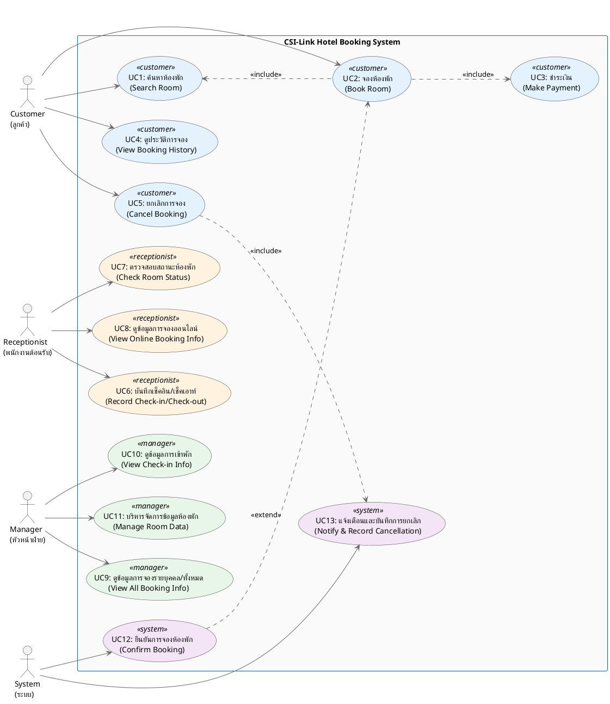
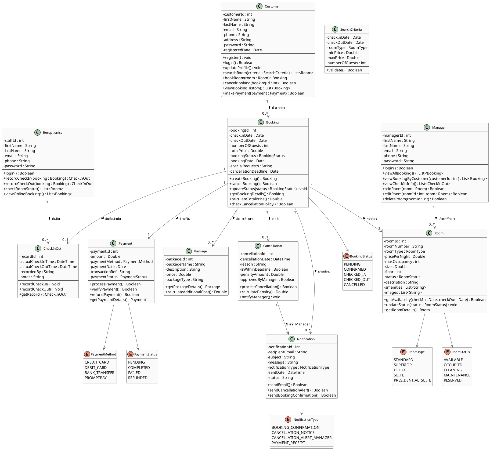

# 🎨 Prompt สำหรับวาด Diagram — CSI-Link Hotel

---

## 📌 วิธีใช้งาน

| เครื่องมือ | วิธีใช้ |
|---|---|
| **PlantUML** | คัดลอก PlantUML Code ไปวางที่ [plantuml.com](https://www.plantuml.com/plantuml/uml/) แล้วกด Submit |
| **Draw.io** | เปิด [draw.io](https://app.diagrams.net/) → Extras → Edit PlantUML → วาง Code |
| **AI (ChatGPT/Gemini)** | คัดลอก AI Prompt ไปวางใน ChatGPT หรือ Gemini แล้วให้สร้างรูปภาพ |
| **Visual Paradigm** | ใช้ PlantUML Import หรือวาดตาม AI Prompt |
| **Lucidchart** | วาดตาม AI Prompt |

---

---

# 🔵 ส่วนที่ 1: USE CASE DIAGRAM

---

## 🟢 PlantUML Code (Use Case Diagram)

คัดลอกโค้ดด้านล่างไปวางที่ https://www.plantuml.com/plantuml/uml/ หรือ Draw.io



---

## 🟡 AI Prompt สำหรับวาด Use Case Diagram

### Prompt ภาษาไทย (ใช้กับ ChatGPT, Gemini, Claude)

```
วาด UML Use Case Diagram ของระบบจองห้องพักโรงแรม "CSI-Link Hotel Booking System" ให้สวยงาม มีรายละเอียดดังนี้:

Actors (ผู้ใช้งาน) 4 ตัว:
1. Customer (ลูกค้า) — อยู่ด้านซ้าย
2. Receptionist (พนักงานต้อนรับ) — อยู่ด้านซ้ายล่าง
3. Manager (หัวหน้าฝ่าย) — อยู่ด้านขวา
4. System (ระบบ) — อยู่ด้านขวาล่าง

Use Cases ทั้งหมด 13 รายการ อยู่ภายในกรอบสี่เหลี่ยม "CSI-Link Hotel Booking System":

Customer เชื่อมกับ:
- UC1: ค้นหาห้องพัก (Search Room)
- UC2: จองห้องพัก (Book Room)
- UC4: ดูประวัติการจอง (View Booking History)
- UC5: ยกเลิกการจอง (Cancel Booking)

Receptionist เชื่อมกับ:
- UC6: บันทึกเช็คอิน/เช็คเอาท์ (Record Check-in/Check-out)
- UC7: ตรวจสอบสถานะห้องพัก (Check Room Status)
- UC8: ดูข้อมูลการจองออนไลน์ (View Online Booking Info)

Manager เชื่อมกับ:
- UC9: ดูข้อมูลการจองรายบุคคล/ทั้งหมด (View All Booking Info)
- UC10: ดูข้อมูลการเข้าพัก (View Check-in Info)
- UC11: บริหารจัดการข้อมูลห้องพัก (Manage Room Data)

System เชื่อมกับ:
- UC12: ยืนยันการจองห้องพัก (Confirm Booking)
- UC13: แจ้งเตือนและบันทึกการยกเลิก (Notify & Record Cancellation)

ความสัมพันธ์ระหว่าง Use Cases:
- UC2 จองห้องพัก <<include>> UC1 ค้นหาห้องพัก (ต้องค้นหาก่อนจอง)
- UC2 จองห้องพัก <<include>> UC3 ชำระเงิน (ต้องชำระเงินเมื่อจอง)
- UC5 ยกเลิกการจอง <<include>> UC13 แจ้งเตือนและบันทึกการยกเลิก
- UC12 ยืนยันการจอง <<extend>> UC2 จองห้องพัก (ระบบยืนยันหลังจองสำเร็จ)

สไตล์: ใช้รูปแบบ UML มาตรฐาน พื้นหลังสีขาว เส้นเชื่อมชัดเจน Actor เป็นรูปคนแท่ง Use Case เป็นวงรี มีชื่อทั้งภาษาไทยและอังกฤษ
```

### Prompt ภาษาอังกฤษ (ใช้กับ ChatGPT Image Generation)

```
Create a professional UML Use Case Diagram for "CSI-Link Hotel Booking System" with a clean white background.

4 Actors (stick figures):
- Customer (left side)
- Receptionist (left-bottom)
- Manager (right side)
- System (right-bottom)

13 Use Cases (ovals) inside a rectangle labeled "CSI-Link Hotel Booking System":

Customer connects to:
- UC1: Search Room
- UC2: Book Room
- UC4: View Booking History
- UC5: Cancel Booking

Receptionist connects to:
- UC6: Record Check-in/Check-out
- UC7: Check Room Status
- UC8: View Online Booking Info

Manager connects to:
- UC9: View All Booking Info
- UC10: View Check-in Info
- UC11: Manage Room Data

System connects to:
- UC12: Confirm Booking
- UC13: Notify & Record Cancellation

Relationships:
- UC2 --<<include>>--> UC1
- UC2 --<<include>>--> UC3
- UC5 --<<include>>--> UC13
- UC12 --<<extend>>--> UC2

Style: Standard UML notation, clear lines, professional look, readable text. Each use case has both Thai and English names.
```

---

---

# 🔴 ส่วนที่ 2: CLASS DIAGRAM

---

## 🟢 PlantUML Code (Class Diagram)

คัดลอกโค้ดด้านล่างไปวางที่ https://www.plantuml.com/plantuml/uml/ หรือ Draw.io



---

## 🟡 AI Prompt สำหรับวาด Class Diagram

### Prompt ภาษาไทย

```
วาด UML Class Diagram ของระบบจองห้องพักโรงแรม "CSI-Link Hotel" ให้สวยงาม มี 11 Class และ 6 Enum ดังนี้:

=== CLASSES (แต่ละ class แสดง attribute และ method) ===

1. Customer (ลูกค้า)
   Attributes: -customerId:int, -firstName:String, -lastName:String, -email:String, -phone:String, -address:String, -password:String, -registeredDate:Date
   Methods: +register():void, +login():Boolean, +updateProfile():void, +searchRoom():List<Room>, +bookRoom():Booking, +cancelBooking():Boolean, +viewBookingHistory():List<Booking>, +makePayment():Boolean

2. Room (ห้องพัก)
   Attributes: -roomId:int, -roomNumber:String, -roomType:RoomType, -pricePerNight:Double, -maxOccupancy:int, -size:Double, -floor:int, -status:RoomStatus, -description:String, -amenities:List<String>, -images:List<String>
   Methods: +getAvailability():Boolean, +updateStatus():void, +getRoomDetails():Room

3. Booking (การจอง)
   Attributes: -bookingId:int, -checkInDate:Date, -checkOutDate:Date, -numberOfGuests:int, -totalPrice:Double, -bookingStatus:BookingStatus, -bookingDate:Date, -specialRequests:String, -cancellationDeadline:Date
   Methods: +createBooking():Booking, +cancelBooking():Boolean, +updateStatus():void, +getBookingDetails():Booking, +calculateTotalPrice():Double, +checkCancellationPolicy():Boolean

4. Payment (การชำระเงิน)
   Attributes: -paymentId:int, -amount:Double, -paymentMethod:PaymentMethod, -paymentDate:Date, -transactionRef:String, -paymentStatus:PaymentStatus
   Methods: +processPayment():Boolean, +verifyPayment():Boolean, +refundPayment():Boolean, +getPaymentDetails():Payment

5. Package (แพ็กเกจเสริม)
   Attributes: -packageId:int, -packageName:String, -description:String, -price:Double, -packageType:String
   Methods: +getPackageDetails():Package, +calculateAdditionalCost():Double

6. CheckInOut (บันทึกเช็คอิน/เช็คเอาท์)
   Attributes: -recordId:int, -actualCheckInTime:DateTime, -actualCheckOutTime:DateTime, -recordedBy:String, -notes:String
   Methods: +recordCheckIn():void, +recordCheckOut():void, +getRecord():CheckInOut

7. Receptionist (พนักงานต้อนรับ)
   Attributes: -staffId:int, -firstName:String, -lastName:String, -email:String, -phone:String, -password:String
   Methods: +login():Boolean, +recordCheckIn():CheckInOut, +recordCheckOut():CheckInOut, +checkRoomStatus():List<Room>, +viewOnlineBookings():List<Booking>

8. Manager (หัวหน้าฝ่าย)
   Attributes: -managerId:int, -firstName:String, -lastName:String, -email:String, -phone:String, -password:String
   Methods: +login():Boolean, +viewAllBookings():List<Booking>, +viewBookingByCustomer():List<Booking>, +viewCheckInInfo():List<CheckInOut>, +addRoom():Boolean, +editRoom():Boolean, +deleteRoom():Boolean

9. Notification (การแจ้งเตือน)
   Attributes: -notificationId:int, -recipientEmail:String, -subject:String, -message:String, -notificationType:NotificationType, -sentDate:DateTime, -status:String
   Methods: +sendEmail():Boolean, +sendCancellationAlert():Boolean, +sendBookingConfirmation():Boolean

10. Cancellation (การยกเลิก)
    Attributes: -cancellationId:int, -cancellationDate:DateTime, -reason:String, -isWithinDeadline:Boolean, -penaltyAmount:Double, -approvedByManager:Boolean
    Methods: +processCancellation():Boolean, +calculatePenalty():Double, +notifyManager():void

11. SearchCriteria (เงื่อนไขการค้นหา)
    Attributes: -checkInDate:Date, -checkOutDate:Date, -roomType:RoomType, -minPrice:Double, -maxPrice:Double, -numberOfGuests:int
    Methods: +validate():Boolean

=== ENUMERATIONS ===

1. RoomType: STANDARD, SUPERIOR, DELUXE, SUITE, PRESIDENTIAL_SUITE
2. RoomStatus: AVAILABLE, OCCUPIED, CLEANING, MAINTENANCE, RESERVED
3. BookingStatus: PENDING, CONFIRMED, CHECKED_IN, CHECKED_OUT, CANCELLED
4. PaymentMethod: CREDIT_CARD, DEBIT_CARD, BANK_TRANSFER, PROMPTPAY
5. PaymentStatus: PENDING, COMPLETED, FAILED, REFUNDED
6. NotificationType: BOOKING_CONFIRMATION, CANCELLATION_NOTICE, CANCELLATION_ALERT_MANAGER, PAYMENT_RECEIPT

=== RELATIONSHIPS (ความสัมพันธ์) ===

- Customer "1" --> "0..*" Booking (ลูกค้า 1 คน มีหลายการจอง)
- Booking "1" --> "1" Room (การจอง 1 รายการ จองห้อง 1 ห้อง)
- Booking "1" --> "1" Payment (การจอง 1 รายการ ชำระเงิน 1 รายการ)
- Booking "1" --> "0..*" Package (การจอง 1 รายการ มีหลายแพ็กเกจ)
- Booking "1" --> "0..1" CheckInOut (การจอง 1 รายการ บันทึก 0 หรือ 1 รายการ)
- Booking "1" --> "0..1" Cancellation (การจอง 1 รายการ ยกเลิก 0 หรือ 1 ครั้ง)
- Booking "1" --> "0..*" Notification (การจอง 1 รายการ มีหลายแจ้งเตือน)
- Receptionist "1" --> "0..*" CheckInOut (พนักงาน 1 คน บันทึกหลายรายการ)
- Manager "1" --> "0..*" Room (Manager บริหารหลายห้อง)
- Cancellation "1" --> "1" Notification (ยกเลิก 1 ครั้ง แจ้งเตือน 1 ครั้ง)
- Room ใช้ RoomType และ RoomStatus
- Booking ใช้ BookingStatus
- Payment ใช้ PaymentMethod และ PaymentStatus
- Notification ใช้ NotificationType

สไตล์: UML มาตรฐาน, พื้นหลังสีขาว, เส้นเชื่อมชัดเจน, แสดง multiplicity, ใช้ - สำหรับ private, + สำหรับ public
```

### Prompt ภาษาอังกฤษ

```
Create a professional UML Class Diagram for "CSI-Link Hotel Booking System" with white background and clear notation.

CLASSES (11 total, each showing attributes with visibility and methods):

1. Customer: customerId, firstName, lastName, email, phone, address, password, registeredDate | Methods: register(), login(), updateProfile(), searchRoom(), bookRoom(), cancelBooking(), viewBookingHistory(), makePayment()

2. Room: roomId, roomNumber, roomType:RoomType, pricePerNight, maxOccupancy, size, floor, status:RoomStatus, description, amenities, images | Methods: getAvailability(), updateStatus(), getRoomDetails()

3. Booking: bookingId, checkInDate, checkOutDate, numberOfGuests, totalPrice, bookingStatus:BookingStatus, bookingDate, specialRequests, cancellationDeadline | Methods: createBooking(), cancelBooking(), updateStatus(), getBookingDetails(), calculateTotalPrice(), checkCancellationPolicy()

4. Payment: paymentId, amount, paymentMethod:PaymentMethod, paymentDate, transactionRef, paymentStatus:PaymentStatus | Methods: processPayment(), verifyPayment(), refundPayment(), getPaymentDetails()

5. Package: packageId, packageName, description, price, packageType | Methods: getPackageDetails(), calculateAdditionalCost()

6. CheckInOut: recordId, actualCheckInTime, actualCheckOutTime, recordedBy, notes | Methods: recordCheckIn(), recordCheckOut(), getRecord()

7. Receptionist: staffId, firstName, lastName, email, phone, password | Methods: login(), recordCheckIn(), recordCheckOut(), checkRoomStatus(), viewOnlineBookings()

8. Manager: managerId, firstName, lastName, email, phone, password | Methods: login(), viewAllBookings(), viewBookingByCustomer(), viewCheckInInfo(), addRoom(), editRoom(), deleteRoom()

9. Notification: notificationId, recipientEmail, subject, message, notificationType:NotificationType, sentDate, status | Methods: sendEmail(), sendCancellationAlert(), sendBookingConfirmation()

10. Cancellation: cancellationId, cancellationDate, reason, isWithinDeadline, penaltyAmount, approvedByManager | Methods: processCancellation(), calculatePenalty(), notifyManager()

11. SearchCriteria: checkInDate, checkOutDate, roomType, minPrice, maxPrice, numberOfGuests | Methods: validate()

ENUMERATIONS (6):
- RoomType: STANDARD, SUPERIOR, DELUXE, SUITE, PRESIDENTIAL_SUITE
- RoomStatus: AVAILABLE, OCCUPIED, CLEANING, MAINTENANCE, RESERVED
- BookingStatus: PENDING, CONFIRMED, CHECKED_IN, CHECKED_OUT, CANCELLED
- PaymentMethod: CREDIT_CARD, DEBIT_CARD, BANK_TRANSFER, PROMPTPAY
- PaymentStatus: PENDING, COMPLETED, FAILED, REFUNDED
- NotificationType: BOOKING_CONFIRMATION, CANCELLATION_NOTICE, CANCELLATION_ALERT_MANAGER, PAYMENT_RECEIPT

RELATIONSHIPS with multiplicity:
- Customer 1 --> 0..* Booking
- Booking 1 --> 1 Room
- Booking 1 --> 1 Payment
- Booking 1 --> 0..* Package
- Booking 1 --> 0..1 CheckInOut
- Booking 1 --> 0..1 Cancellation
- Booking 1 --> 0..* Notification
- Receptionist 1 --> 0..* CheckInOut
- Manager 1 --> 0..* Room
- Cancellation 1 --> 1 Notification

Use standard UML class notation with - for private, + for public attributes/methods. Show association arrows with multiplicity labels.
```

---

---

# 🟣 ส่วนที่ 3: วิธีใช้งานทีละขั้นตอน

---

## วิธีที่ 1: ใช้ PlantUML Online (แนะนำ ⭐ ง่ายที่สุด)

1. เปิดเว็บ https://www.plantuml.com/plantuml/uml/
2. ลบโค้ดเก่าออกทั้งหมด
3. คัดลอก **PlantUML Code** จากด้านบน วางลงไป
4. กด **Submit** หรือรอระบบ render
5. คลิกขวาที่รูป → **Save Image As** เพื่อบันทึกเป็นไฟล์ PNG/SVG

---

## วิธีที่ 2: ใช้ Draw.io (Diagrams.net)

1. เปิด https://app.diagrams.net/
2. สร้าง Diagram ใหม่
3. ไปที่เมนู **Extras** → **Edit PlantUML**  (หรือ **+** → **Advanced** → **PlantUML**)
4. วาง **PlantUML Code** ลงไป
5. กด **Close** → Diagram จะถูก render
6. สามารถ Export เป็น PNG, SVG, PDF ได้

---

## วิธีที่ 3: ใช้ ChatGPT / Gemini สร้างรูปภาพ

1. เปิด ChatGPT (GPT-4 with DALL·E) หรือ Gemini
2. คัดลอก **AI Prompt** จากด้านบน
3. วางใน Chat แล้วส่ง
4. AI จะสร้างรูป Diagram ให้

> ⚠️ **หมายเหตุ:** AI อาจวาดไม่ตรงตาม UML มาตรฐาน 100% แนะนำใช้ PlantUML สำหรับความถูกต้อง

---

## วิธีที่ 4: ใช้ Visual Studio Code + PlantUML Extension

1. ติดตั้ง Extension: **PlantUML** (jebbs.plantuml)
2. สร้างไฟล์ `.puml` ใหม่
3. วาง PlantUML Code ลงไป
4. กด `Alt+D` เพื่อ Preview
5. คลิกขวา → **Export Diagram** เพื่อบันทึก

---

## วิธีที่ 5: ใช้ Lucidchart

1. เปิด https://www.lucidchart.com/
2. สร้าง Diagram ใหม่ → เลือก **UML Use Case Diagram** หรือ **UML Class Diagram**
3. วาดตาม **AI Prompt** ที่ให้ไว้ (ลาก Drop Elements ตาม)
4. Export เป็น PNG/PDF

---

> 💡 **สรุป:** วิธีที่ง่ายและแม่นยำที่สุดคือ **PlantUML Online** — แค่คัดลอก Code วาง แล้วกด Submit ได้รูปเลย!
