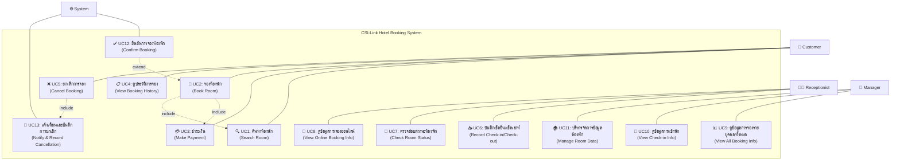
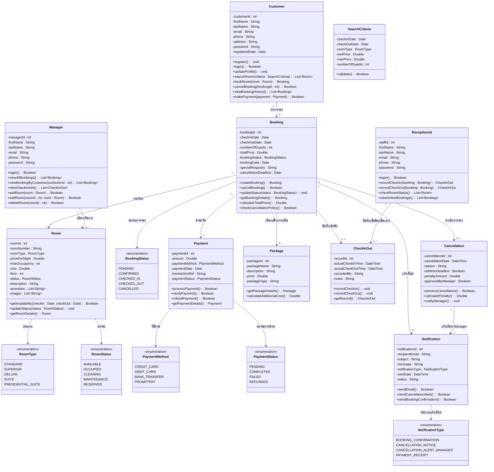

# 🏨 CSI-Link Hotel — Use Case & Class Diagram

## Workshop #2: วิเคราะห์กรณีศึกษาเพื่อทำการออกแบบ UML ด้วย Use Case & Class Diagram

---

## 📌 สรุปภาพรวมของระบบ

ระบบจองห้องพักโรงแรม CSI-Link Hotel ผ่านช่องทางออนไลน์ แบ่งผู้ใช้งานออกเป็น 4 ส่วน:

| ผู้ใช้งาน (Actor) | บทบาท |
|---|---|
| **Customer (ลูกค้า)** | จองห้องพักออนไลน์, ค้นหาห้องพัก, ชำระเงิน, ดูประวัติการจอง, ยกเลิกการจอง |
| **Receptionist (พนักงานต้อนรับ)** | บันทึกเช็คอิน/เช็คเอาท์, ตรวจสอบสถานะห้องพัก, ดูข้อมูลการจองออนไลน์ |
| **Manager (หัวหน้าฝ่าย)** | ดูข้อมูลการจองทั้งหมด, ดูข้อมูลการเข้าพัก, บริหารจัดการข้อมูลห้องพัก |
| **System (ระบบ)** | ยืนยันการจองอัตโนมัติ, แจ้งเตือนและบันทึกการยกเลิก |

---

## 📊 Use Case Diagram

---

## 📝 Use Case Description โดยละเอียด (Production-Level)

> **หมายเหตุ:** Use Case ด้านล่างเขียนในระดับ Production-Grade ครอบคลุม Business Rules, Data Validation,
> Exception Handling, Security, Concurrency, Audit Trail และ Non-functional Requirements
> เพื่อให้สามารถส่งต่อทีมพัฒนา (Developer) ได้โดยไม่ต้องถามคำถามเพิ่ม

---

### UC1: ค้นหาห้องพัก (Search Room)

| รายการ | รายละเอียด |
|---|---|
| **Use Case ID** | UC1 |
| **Use Case Name** | ค้นหาห้องพัก (Search Room) |
| **Actor(s)** | Customer (Primary), System (Supporting) |
| **Stakeholders** | Customer — ต้องการค้นหาห้องพักที่ตรงกับความต้องการอย่างรวดเร็ว โรงแรม — ต้องการนำเสนอห้องพักที่มีอัตราการเข้าพักต่ำก่อน เพื่อเพิ่มรายได้ |
| **Description** | ผู้ใช้บริการสามารถค้นหาห้องพักที่พร้อมใช้งาน โดยระบุวันที่เช็คอิน/เช็คเอาท์ ประเภทห้องพัก ช่วงราคา จำนวนผู้เข้าพัก ระบบจะแสดงผลลัพธ์ที่ตรงเงื่อนไข เรียงลำดับตามราคาต่ำสุดก่อน (หรือตามอัลกอริทึมที่โรงแรมกำหนด) พร้อมรูปภาพ สิ่งอำนวยความสะดวก และรีวิวจากลูกค้า |
| **Level** | User Goal |
| **Priority** | สูงมาก (Must-have) |
| **Frequency of Use** | สูงมาก — คาดว่ามากกว่า 500 ครั้ง/วัน |
| **Pre-condition** | 1. ผู้ใช้เข้าถึงระบบจองห้องพักออนไลน์ผ่าน Web Browser หรือ Mobile App 2. ระบบ Online และฐานข้อมูลห้องพักพร้อมใช้งาน 3. ข้อมูลห้องพักและราคาถูกอัปเดตแล้ว |
| **Post-condition (Success)** | 1. ระบบแสดงรายการห้องพักที่พร้อมให้บริการตามเงื่อนไข 2. แต่ละรายการแสดงรายละเอียด: ชื่อห้อง, ประเภท, ราคา/คืน, ขนาด, จำนวนผู้เข้าพักสูงสุด, สิ่งอำนวยความสะดวก, รูปภาพอย่างน้อย 1 รูป 3. ระบบบันทึก Search Log สำหรับการวิเคราะห์ (Analytics) |
| **Post-condition (Failure)** | ระบบแสดงข้อความแนะนำให้ปรับเงื่อนไข พร้อมห้องพักทางเลือกที่ใกล้เคียง (ถ้ามี) |
| **Trigger** | ผู้ใช้กดปุ่ม "ค้นหา" ในหน้าค้นหาห้องพัก |

**Business Rules:**

| รหัส | กฎ | รายละเอียด |
|---|---|---|
| **BR1.1** | ระยะเวลาจองขั้นต่ำ | จำนวนคืนขั้นต่ำ = 1 คืน (เช็คเอาท์ > เช็คอิน อย่างน้อย 1 วัน) |
| **BR1.2** | ระยะเวลาจองสูงสุด | จำนวนคืนสูงสุด = 30 คืน ต่อ 1 การจอง |
| **BR1.3** | ระยะเวลาจองล่วงหน้า | สามารถจองล่วงหน้าได้สูงสุด 365 วัน นับจากวันปัจจุบัน |
| **BR1.4** | วันที่เช็คอิน | ต้องเป็นวันปัจจุบันหรืออนาคตเท่านั้น (ไม่รับวันที่ในอดีต) |
| **BR1.5** | การเรียงลำดับผลลัพธ์ | เริ่มต้น: เรียงตามราคาต่ำสุด → สูงสุด, ผู้ใช้สามารถเปลี่ยนเป็น: ราคาสูง→ต่ำ, รีวิวดีที่สุด, ห้องใหญ่ที่สุด |
| **BR1.6** | จำนวนผลลัพธ์ต่อหน้า | แสดง 10 รายการต่อหน้า พร้อม Pagination |
| **BR1.7** | ห้องพักที่แสดง | แสดงเฉพาะห้องที่ status = AVAILABLE หรือ RESERVED (ที่ยังไม่ถึงวันจอง) |

**Data Validation Rules:**

| ฟิลด์ | กฎ | ข้อความ Error |
|---|---|---|
| checkInDate | ต้องไม่เป็น null, ต้อง ≥ วันปัจจุบัน, ต้อง ≤ วันปัจจุบัน + 365 วัน | "กรุณาระบุวันที่เช็คอินที่ถูกต้อง (ตั้งแต่วันนี้ถึง 1 ปีข้างหน้า)" |
| checkOutDate | ต้องไม่เป็น null, ต้อง > checkInDate, ต้อง ≤ checkInDate + 30 วัน | "วันที่เช็คเอาท์ต้องอยู่หลังวันเช็คอิน และไม่เกิน 30 คืน" |
| roomType | ถ้าระบุ ต้องเป็นค่าใน Enum RoomType | "ประเภทห้องพักไม่ถูกต้อง" |
| numberOfGuests | ถ้าระบุ ต้องเป็นจำนวนเต็ม ≥ 1 และ ≤ 10 | "จำนวนผู้เข้าพักต้องอยู่ระหว่าง 1-10 คน" |
| minPrice | ถ้าระบุ ต้อง ≥ 0 | "ราคาขั้นต่ำต้องไม่ติดลบ" |
| maxPrice | ถ้าระบุ ต้อง > minPrice | "ราคาสูงสุดต้องมากกว่าราคาต่ำสุด" |

**Main Flow (Basic Flow):**

| ขั้นตอน | ผู้กระทำ | การกระทำ |
|---|---|---|
| 1 | Customer | เข้าสู่หน้าค้นหาห้องพักในระบบออนไลน์ |
| 2 | System | แสดงแบบฟอร์มค้นหา พร้อมค่าเริ่มต้น (checkInDate = วันนี้, checkOutDate = พรุ่งนี้, guests = 2) |
| 3 | Customer | ระบุวันที่ต้องการเช็คอิน (Check-in Date) ผ่าน Date Picker |
| 4 | System | Validate วันเช็คอินทันที (Client-side) — ต้อง ≥ วันปัจจุบัน |
| 5 | Customer | ระบุวันที่ต้องการเช็คเอาท์ (Check-out Date) ผ่าน Date Picker |
| 6 | System | Validate วันเช็คเอาท์ทันที — ต้อง > วันเช็คอิน, แสดงจำนวนคืนอัตโนมัติ |
| 7 | Customer | (ถ้าต้องการ) เลือกประเภทห้องพัก จาก Dropdown (Standard / Superior / Deluxe / Suite / Presidential Suite) |
| 8 | Customer | (ถ้าต้องการ) ระบุจำนวนผู้เข้าพัก |
| 9 | Customer | (ถ้าต้องการ) ระบุช่วงราคาที่ต้องการ (Slider หรือ Input) |
| 10 | Customer | กดปุ่ม "ค้นหา" |
| 11 | System | **Server-side Validation:** ตรวจสอบเงื่อนไขทั้งหมดซ้ำอีกครั้ง (ป้องกันการแก้ไข Client-side) |
| 12 | System | สร้าง SQL Query: `SELECT * FROM rooms WHERE status IN ('AVAILABLE') AND roomId NOT IN (SELECT roomId FROM bookings WHERE checkInDate < :checkOut AND checkOutDate > :checkIn AND bookingStatus NOT IN ('CANCELLED'))` |
| 13 | System | กรองตามเงื่อนไขเพิ่มเติม (ประเภท, ราคา, จำนวนผู้เข้าพัก) |
| 14 | System | เรียงลำดับผลลัพธ์ตามราคาต่ำสุด (default) |
| 15 | System | แสดงรายการห้องพักที่พร้อมให้บริการ (แบ่งหน้า 10 รายการ/หน้า) พร้อมรายละเอียด: • รูปภาพห้องพัก (Thumbnail) • ชื่อห้อง / หมายเลขห้อง • ประเภทห้อง • ราคา/คืน + ราคารวม (จำนวนคืน × ราคา/คืน) • ขนาดห้อง (ตร.ม.) • จำนวนผู้เข้าพักสูงสุด • สิ่งอำนวยความสะดวกหลัก (ไอคอน: Wi-Fi, แอร์, TV, ตู้เย็น ฯลฯ) • ปุ่ม "จอง" |
| 16 | System | แสดงจำนวนผลลัพธ์ทั้งหมด + ตัวกรองด้านข้าง (Sidebar Filter) |
| 17 | System | บันทึก Search Log: `{userId, searchCriteria, resultCount, timestamp}` สำหรับ Analytics |

**Alternative Flow:**

| รหัส | เงื่อนไข | การกระทำ |
|---|---|---|
| **AF1.1** | วันที่เช็คอินอยู่ในอดีต | แสดง Inline Error ใต้ช่อง Date Picker: "กรุณาระบุวันที่เช็คอินที่ถูกต้อง (ตั้งแต่วันนี้เป็นต้นไป)" ปุ่ม "ค้นหา" จะ Disabled จนกว่าจะแก้ไข |
| **AF1.2** | วันเช็คเอาท์ ≤ วันเช็คอิน | แสดง Inline Error: "วันที่เช็คเอาท์ต้องอยู่หลังวันเช็คอิน" + Auto-correct เช็คเอาท์เป็นเช็คอิน +1 วัน |
| **AF1.3** | จำนวนคืน > 30 | แสดง Error: "จองได้สูงสุด 30 คืนต่อครั้ง กรุณาติดต่อฝ่ายจองโดยตรงสำหรับการเข้าพักระยะยาว" |
| **AF1.4** | ไม่พบห้องพักตามเงื่อนไข | แสดง Empty State: • ข้อความ: "ไม่พบห้องพักที่ว่างตามเงื่อนไขที่ระบุ" • แนะนำ: "ลองเปลี่ยนวันที่ หรือเลือกประเภทห้องอื่น" • แสดงห้องพักทางเลือก (วันที่ใกล้เคียง ±3 วัน) ถ้ามี |
| **AF1.5** | Server-side Validation ล้มเหลว | แสดง Error Message ทั่วไป + บันทึก Error Log + แจ้งเตือนทีม Dev |
| **AF1.6** | Database Timeout (> 5 วินาที) | แสดง Loading Spinner สูงสุด 10 วินาที จากนั้นแสดง "ระบบกำลังประมวลผล กรุณาลองใหม่อีกครั้ง" |

**Exception Flow:**

| รหัส | เงื่อนไข | การกระทำ |
|---|---|---|
| **EX1.1** | ระบบฐานข้อมูลล่ม | แสดง Error Page: "ระบบขัดข้อง กรุณาลองใหม่ภายหลัง" + บันทึก Critical Log + แจ้ง Admin ทาง Email/SMS |
| **EX1.2** | ผู้ใช้ส่ง Request ซ้ำเร็วเกินไป (Rate Limit) | จำกัด 10 requests/นาที/IP → แสดง "กรุณารอสักครู่ก่อนค้นหาอีกครั้ง" |
| **EX1.3** | ข้อมูลห้องพักไม่สมบูรณ์ (ไม่มีรูปภาพ/ราคา) | ซ่อนห้องพักนั้นจากผลลัพธ์ + บันทึก Warning Log สำหรับทีมจัดการ |

**Non-functional Requirements:**

| ด้าน | ความต้องการ |
|---|---|
| **Performance** | ผลลัพธ์ต้องแสดงภายใน ≤ 3 วินาที สำหรับ 95% ของ Requests |
| **Availability** | ระบบค้นหาต้องพร้อมใช้งาน 99.9% (Uptime) |
| **Caching** | Cache ผลลัพธ์การค้นหายอดนิยม (Hot Search) ไว้ 5 นาที |
| **Security** | Sanitize ทุก Input เพื่อป้องกัน SQL Injection และ XSS |
| **Responsive** | แสดงผลได้ดีทั้ง Desktop, Tablet, Mobile (Responsive Design) |
| **SEO** | URL ค้นหาต้องเป็น Clean URL เช่น `/search?checkin=2026-07-10&checkout=2026-07-12&type=deluxe` |
| **Accessibility** | รองรับ Screen Reader, Keyboard Navigation, WCAG 2.1 Level AA |

---

### UC2: จองห้องพัก (Book Room)

| รายการ | รายละเอียด |
|---|---|
| **Use Case ID** | UC2 |
| **Use Case Name** | จองห้องพัก (Book Room) |
| **Actor(s)** | Customer (Primary), System (Supporting) |
| **Stakeholders** | Customer — ต้องการจองห้องพักได้สะดวกรวดเร็ว โรงแรม — ต้องการบันทึกข้อมูลการจองที่ถูกต้อง ป้องกัน Overbooking ฝ่ายบัญชี — ต้องการข้อมูลการชำระเงินที่ครบถ้วน |
| **Description** | ลูกค้าเลือกห้องพักจากผลลัพธ์การค้นหา ระบุวันที่เข้าพัก จำนวนผู้เข้าพัก (ปกติ 2 คน สามารถเพิ่มได้ตามขนาดห้อง โดยมีค่าบริการเพิ่ม) เลือกแพ็กเกจเสริม (อาหารเช้า, อาหารค่ำ, สปา ฯลฯ) ตรวจสอบสรุปรายการ แล้วดำเนินการชำระเงิน เมื่อสำเร็จระบบจะออกหมายเลขการจอง (Booking ID) และส่งยืนยันทางอีเมล |
| **Level** | User Goal |
| **Priority** | สูงมาก (Must-have) |
| **Frequency of Use** | สูง — คาดว่า 50-200 ครั้ง/วัน |
| **Pre-condition** | 1. ผู้ใช้เข้าถึงระบบออนไลน์แล้ว (ไม่จำเป็นต้อง Login — สามารถจองแบบ Guest ได้) 2. มีห้องพักว่างตามเงื่อนไขที่ต้องการ (จาก UC1) 3. ระบบชำระเงินพร้อมใช้งาน |
| **Post-condition (Success)** | 1. ระบบสร้าง Booking record ใหม่ใน DB ด้วยสถานะ "CONFIRMED" 2. ห้องพักถูกล็อค (Reserved) สำหรับวันที่จอง ไม่ให้ผู้อื่นจองซ้ำ 3. Payment record ถูกบันทึก ด้วยสถานะ "COMPLETED" 4. ลูกค้าได้รับอีเมลยืนยันการจอง พร้อม Booking ID 5. Audit Log ถูกบันทึก: `{action: "BOOKING_CREATED", bookingId, customerId, timestamp}` |
| **Post-condition (Failure)** | 1. ไม่มี Booking record ถูกสร้าง 2. ห้องพักไม่ถูกล็อค 3. ไม่มีการหักเงินจากลูกค้า (ถ้ามีการหัก ต้อง Rollback ทันที) 4. ลูกค้าได้รับแจ้งเตือนข้อผิดพลาดที่ชัดเจน |
| **Trigger** | ลูกค้ากดปุ่ม "จองห้องพัก" ในหน้าแสดงรายการห้องพักที่ว่าง |
| **Include** | UC1 (ค้นหาห้องพัก), UC3 (ชำระเงิน) |
| **Extend** | UC12 (ยืนยันการจองห้องพัก — ส่งอีเมลยืนยัน) |

**Business Rules:**

| รหัส | กฎ | รายละเอียด |
|---|---|---|
| **BR2.1** | จำนวนผู้เข้าพักเริ่มต้น | ค่า Default = 2 คน |
| **BR2.2** | ค่าบริการผู้เข้าพักเพิ่ม | เมื่อจำนวนผู้เข้าพัก > 2 คน จะคิดค่าเตียงเสริม 500 บาท/คน/คืน |
| **BR2.3** | จำนวนผู้เข้าพักสูงสุด | ต้อง ≤ maxOccupancy ของห้องพัก |
| **BR2.4** | การล็อคห้องพัก (Reservation Lock) | เมื่อลูกค้ากดปุ่ม "จองห้องพัก" ระบบจะล็อคห้องไว้ 15 นาที หากไม่ชำระเงินภายในเวลา ห้องจะถูกปล่อย |
| **BR2.5** | Overbooking Prevention | ห้ามจองห้องเดียวกันในวันที่ซ้อนทับกัน — ใช้ Database-level Lock |
| **BR2.6** | แพ็กเกจเสริม | สามารถเลือกได้หลายแพ็กเกจ, คิดราคาต่อคน/ต่อคืน ตามประเภท |
| **BR2.7** | ราคารวม | ราคารวม = (ราคาห้อง × จำนวนคืน) + (ค่าเตียงเสริม × จำนวนคนเพิ่ม × จำนวนคืน) + Σ(ราคาแพ็กเกจเสริม) + ภาษี (VAT 7%) |
| **BR2.8** | กำหนดเส้นตายยกเลิก | Cancellation Deadline = checkInDate - 3 วัน (ยกเลิกฟรีก่อน 3 วัน) |
| **BR2.9** | Booking ID Format | รูปแบบ: `BK` + ปี (4 หลัก) + เดือน (2 หลัก) + Running Number (5 หลัก) เช่น `BK202607-00001` |

**Data Validation Rules:**

| ฟิลด์ | กฎ | ข้อความ Error |
|---|---|---|
| checkInDate | ต้องไม่เป็น null, ≥ วันปัจจุบัน | "กรุณาระบุวันเช็คอินที่ถูกต้อง" |
| checkOutDate | ต้องไม่เป็น null, > checkInDate | "วันเช็คเอาท์ต้องอยู่หลังวันเช็คอิน" |
| numberOfGuests | ต้อง ≥ 1, ≤ maxOccupancy ของห้อง | "จำนวนผู้เข้าพักต้องอยู่ระหว่าง 1-{maxOccupancy} คน" |
| customerName | ต้องไม่เป็นค่าว่าง, 2-100 ตัวอักษร | "กรุณาระบุชื่อ-นามสกุล" |
| customerEmail | ต้องเป็นรูปแบบ Email ที่ถูกต้อง (RFC 5322) | "รูปแบบอีเมลไม่ถูกต้อง" |
| customerPhone | ต้องเป็นตัวเลข 9-15 หลัก | "กรุณาระบุเบอร์โทรศัพท์ที่ถูกต้อง" |

**Main Flow (Basic Flow):**

| ขั้นตอน | ผู้กระทำ | การกระทำ |
|---|---|---|
| 1 | Customer | กดปุ่ม "จอง" ที่ห้องพักที่ต้องการ จากรายการผลลัพธ์การค้นหา (UC1) |
| 2 | System | **ตรวจสอบ Real-time Availability:** Query DB อีกครั้งว่าห้องยังว่างอยู่ |
| 3 | System | **ล็อคห้องพัก (Reservation Lock):** ล็อคห้องไว้ 15 นาที เริ่มนับถอยหลัง |
| 4 | System | แสดงหน้ารายละเอียดการจอง: • ข้อมูลห้องพัก (รูปภาพ Gallery, ประเภท, ราคา/คืน, ขนาด, สิ่งอำนวยความสะดวก) • วันเช็คอิน / เช็คเอาท์ (แก้ไขได้) • จำนวนคืน (คำนวณอัตโนมัติ) • Timer: "กรุณาชำระเงินภายใน 15:00 นาที" |
| 5 | Customer | ยืนยัน/แก้ไข วันที่เช็คอิน-เช็คเอาท์ |
| 6 | Customer | ระบุจำนวนผู้เข้าพัก (Default = 2) |
| 7 | System | ตรวจสอบ numberOfGuests ≤ maxOccupancy ถ้า > 2 คน: แสดงค่าเตียงเสริม = (จำนวนคนเพิ่ม × 500 บาท/คืน) |
| 8 | Customer | เลือกแพ็กเกจเสริม (Checkbox — เลือกได้หลายรายการ): ☐ อาหารเช้า — 350 บาท/คน/วัน ☐ อาหารค่ำ — 500 บาท/คน/วัน ☐ สปา — 1,200 บาท/คน ☐ รถรับ-ส่งสนามบิน — 800 บาท/เที่ยว |
| 9 | System | **คำนวณราคารวมแบบ Real-time:** ราคาห้อง = pricePerNight × numberOfNights ค่าเตียงเสริม = (guests - 2) × 500 × numberOfNights (ถ้า guests > 2) ค่าแพ็กเกจ = Σ(packagePrice × จำนวนตามประเภท) ภาษี VAT = (ราคาห้อง + ค่าเตียง + ค่าแพ็กเกจ) × 7% **ราคารวมสุทธิ = ราคาห้อง + ค่าเตียง + ค่าแพ็กเกจ + VAT** |
| 10 | System | แสดงหน้าสรุปการจอง (Order Summary): • รายละเอียดห้องพัก • วันที่เข้าพัก (จำนวนคืน) • จำนวนผู้เข้าพัก • แพ็กเกจเสริมที่เลือก • ราคาแต่ละรายการ • ภาษี VAT 7% • **ราคารวมสุทธิ (ตัวหนา)** • นโยบายการยกเลิก (Cancellation Deadline) |
| 11 | Customer | กรอกข้อมูลส่วนตัว (ถ้ายังไม่ Login): ชื่อ-นามสกุล, อีเมล, เบอร์โทร |
| 12 | Customer | (ถ้าต้องการ) ระบุ Special Requests เช่น "ต้องการเตียงเด็ก", "ชั้นสูง", "ห้องไม่สูบบุหรี่" |
| 13 | Customer | ตรวจสอบรายละเอียดทั้งหมด กดปุ่ม **"ยืนยันและชำระเงิน"** |
| 14 | System | **Server-side Validation:** ตรวจสอบข้อมูลทั้งหมดอีกครั้ง |
| 15 | System | **ตรวจสอบ Availability ครั้งสุดท้าย** (ป้องกัน Race Condition) ด้วย Database Transaction Lock |
| 16 | System | เข้าสู่กระบวนการชำระเงิน → **Include: UC3 (ชำระเงิน)** |
| 17 | System | (เมื่อชำระเงินสำเร็จ) สร้าง Booking Record: `{bookingId, customerId, roomId, checkInDate, checkOutDate, numberOfGuests, totalPrice, bookingStatus: CONFIRMED, bookingDate: NOW(), cancellationDeadline, specialRequests}` |
| 18 | System | สร้าง Payment Record: `{paymentId, bookingId, amount, paymentMethod, paymentDate: NOW(), paymentStatus: COMPLETED}` |
| 19 | System | อัปเดตสถานะห้องพัก: เพิ่ม Reservation สำหรับช่วงวันที่จอง |
| 20 | System | **บันทึก Audit Log:** `{action: "BOOKING_CREATED", bookingId, customerId, roomId, totalPrice, timestamp, ipAddress}` |
| 21 | System | → **Extend: UC12 (ยืนยันการจองห้องพัก)** — ส่งอีเมลยืนยัน |
| 22 | System | แสดงหน้า "จองสำเร็จ" พร้อม: • Booking ID • QR Code สำหรับเช็คอิน • สรุปรายละเอียดทั้งหมด • ปุ่ม "ดูประวัติการจอง" และ "พิมพ์ใบยืนยัน" |

**Alternative Flow:**

| รหัส | เงื่อนไข | การกระทำ |
|---|---|---|
| **AF2.1** | ห้องพักถูกจองไปแล้ว (ตรวจสอบขั้นตอน 2) | แสดง Modal: "ห้องพักนี้เพิ่งถูกจองไปแล้ว" • แนะนำห้องพักทางเลือก (ประเภทเดียวกัน/ใกล้เคียง) • ปุ่ม "ค้นหาห้องอื่น" |
| **AF2.2** | จำนวนผู้เข้าพัก > maxOccupancy | แสดง Warning: "ห้องนี้รองรับสูงสุด {maxOccupancy} คน" • แนะนำห้องที่ใหญ่กว่า • ปุ่ม "เลือกห้องใหญ่กว่า" |
| **AF2.3** | Timer หมดเวลา (15 นาที) | แสดง Modal: "เวลาในการจองหมดอายุ" • ปล่อย Reservation Lock • ปุ่ม "จองใหม่อีกครั้ง" (เริ่ม Timer ใหม่) |
| **AF2.4** | การชำระเงินไม่สำเร็จ (จาก UC3) | แสดง Error จาก UC3 • ไม่สร้าง Booking Record • ยัง Lock ห้องอยู่ (ถ้ายังไม่หมดเวลา) • ปุ่ม "ลองชำระเงินอีกครั้ง" หรือ "เปลี่ยนช่องทาง" |
| **AF2.5** | Server-side Validation ล้มเหลว (ขั้นตอน 14) | แสดง Error เฉพาะฟิลด์ที่ไม่ผ่าน + Highlight ช่องที่ต้องแก้ไข |
| **AF2.6** | Race Condition: ห้องถูกจองระหว่างชำระเงิน (ขั้นตอน 15) | **Rollback** การชำระเงิน แสดง: "ขออภัย ห้องพักนี้เพิ่งถูกจองไปขณะที่ท่านชำระเงิน ยอดเงินจะถูกคืนภายใน 3-5 วันทำการ" บันทึก Incident Log |
| **AF2.7** | ลูกค้ากดปุ่ม "ย้อนกลับ" หรือปิดหน้า | ปล่อย Reservation Lock ทันที, ไม่สร้าง Booking |

**Exception Flow:**

| รหัส | เงื่อนไข | การกระทำ |
|---|---|---|
| **EX2.1** | Database Transaction ล้มเหลว | Rollback ทุก Operation (Booking, Payment, Reservation) แสดง "เกิดข้อผิดพลาด กรุณาลองใหม่" บันทึก Critical Error Log |
| **EX2.2** | ระบบ Payment Gateway ล่ม | แสดง "ระบบชำระเงินขัดข้อง" + ปุ่ม "ลองอีกครั้ง" ยัง Lock ห้องอยู่ จนกว่า Timer จะหมด |
| **EX2.3** | Email Service ล่ม (ขั้นตอน 21) | Booking ยังสำเร็จ (ไม่ Rollback) ใส่ Email ใน Retry Queue (ส่งซ้ำทุก 5 นาที สูงสุด 5 ครั้ง) บันทึก Warning Log |

**Concurrency Handling:**

| สถานการณ์ | วิธีจัดการ |
|---|---|
| ลูกค้า 2 คนกดจองห้องเดียวกันพร้อมกัน | ใช้ Pessimistic Locking: คนแรกที่ได้ Lock จะจองได้ คนที่สองจะได้ AF2.1 |
| ลูกค้ากดจองซ้ำ (Double Submit) | ใช้ Idempotency Key: หากส่ง Request ซ้ำด้วย Key เดิม จะ Return Booking เดิมโดยไม่สร้างใหม่ |

---

### UC3: ชำระเงิน (Make Payment)

| รายการ | รายละเอียด |
|---|---|
| **Use Case ID** | UC3 |
| **Use Case Name** | ชำระเงิน (Make Payment) |
| **Actor(s)** | Customer (Primary), Payment Gateway (Supporting), System (Supporting) |
| **Stakeholders** | Customer — ต้องการชำระเงินอย่างปลอดภัย ฝ่ายบัญชี — ต้องการข้อมูลการเงินที่ถูกต้องครบถ้วน ธนาคาร/Payment Provider — ต้องปฏิบัติตามมาตรฐาน PCI-DSS |
| **Description** | ลูกค้าเลือกช่องทางการชำระเงินจาก 3 ช่องทาง (บัตรเครดิต/เดบิต, โอนผ่านธนาคาร, พร้อมเพย์) กรอกข้อมูลการชำระเงิน ระบบตรวจสอบ ดำเนินการหักเงิน และบันทึกผลลัพธ์ |
| **Level** | Sub-function (เรียกจาก UC2) |
| **Priority** | สูงมาก (Must-have) |
| **Frequency of Use** | เท่ากับ UC2 — 50-200 ครั้ง/วัน |
| **Pre-condition** | 1. ลูกค้ากรอกข้อมูลการจองเรียบร้อยแล้ว (จาก UC2) 2. ยอดรวมค่าใช้จ่ายถูกคำนวณแล้ว 3. ห้องพักยังถูกล็อค (Reservation Lock ยังไม่หมด) 4. Payment Gateway พร้อมใช้งาน |
| **Post-condition (Success)** | 1. เงินถูกหักจากบัญชีลูกค้า 2. Payment Record ถูกสร้างด้วยสถานะ COMPLETED 3. Transaction Reference Number ถูกบันทึก 4. Audit Log: `{action: "PAYMENT_COMPLETED", paymentId, bookingId, amount, method, timestamp}` |
| **Post-condition (Failure)** | 1. ไม่มีเงินถูกหัก (หรือ Rollback สำเร็จ) 2. Payment Record ถูกสร้างด้วยสถานะ FAILED 3. ลูกค้าได้รับแจ้งเหตุผลที่ชำระไม่สำเร็จ |
| **Trigger** | เรียกจาก UC2 ขั้นตอน 16 (ยืนยันและชำระเงิน) |

**Business Rules:**

| รหัส | กฎ | รายละเอียด |
|---|---|---|
| **BR3.1** | ช่องทางที่รองรับ | 1. บัตรเครดิต/เดบิต (Visa, MasterCard, JCB) 2. โอนผ่านธนาคาร (กสิกร, กรุงเทพ, กรุงไทย, ไทยพาณิชย์) 3. พร้อมเพย์ (PromptPay QR Code) |
| **BR3.2** | สกุลเงิน | รับชำระเป็นบาทไทย (THB) เท่านั้น |
| **BR3.3** | จำนวนเงินขั้นต่ำ | ต้อง > 0 บาท |
| **BR3.4** | เวลาชำระเงินสูงสุด | ต้องชำระภายใน 15 นาที (จาก Timer ใน UC2) |
| **BR3.5** | Retry Limit | ชำระเงินไม่สำเร็จได้สูงสุด 3 ครั้ง/การจอง |
| **BR3.6** | ค่าธรรมเนียม | ไม่เรียกเก็บค่าธรรมเนียมเพิ่มเติมจากลูกค้า |
| **BR3.7** | ใบเสร็จอิเล็กทรอนิกส์ | สร้าง E-Receipt อัตโนมัติ ส่งพร้อมอีเมลยืนยัน |

**Data Validation Rules (แยกตามช่องทาง):**

**บัตรเครดิต/เดบิต:**

| ฟิลด์ | กฎ | ข้อความ Error |
|---|---|---|
| cardNumber | ตัวเลข 13-19 หลัก, ผ่าน Luhn Algorithm | "หมายเลขบัตรไม่ถูกต้อง" |
| cardHolderName | ไม่เป็นค่าว่าง, ตัวอักษร A-Z + ช่องว่าง | "กรุณาระบุชื่อบนบัตร (ภาษาอังกฤษ)" |
| expiryDate | รูปแบบ MM/YY, ต้องไม่หมดอายุ | "บัตรหมดอายุแล้ว" |
| cvv | ตัวเลข 3-4 หลัก | "รหัส CVV ไม่ถูกต้อง" |

**โอนผ่านธนาคาร:**

| ฟิลด์ | กฎ | ข้อความ Error |
|---|---|---|
| bankName | ต้องเลือกธนาคาร | "กรุณาเลือกธนาคาร" |
| transferSlip | อัปโหลดรูปภาพ (JPG/PNG/PDF), ขนาด ≤ 5MB | "กรุณาอัปโหลดหลักฐานการโอน" |
| transferAmount | ต้องตรงกับยอดเงินที่ต้องชำระ (±0 บาท) | "จำนวนเงินที่โอนไม่ตรงกับยอดที่ต้องชำระ" |

**พร้อมเพย์:**

| ฟิลด์ | กฎ | ข้อความ Error |
|---|---|---|
| - | ระบบสร้าง QR Code อัตโนมัติ ลูกค้าแค่สแกน | - |
| paymentConfirmation | ระบบตรวจสอบ Callback จาก Payment Gateway | "ยังไม่ได้รับการยืนยันการชำระเงิน" |

**Main Flow (Basic Flow):**

| ขั้นตอน | ผู้กระทำ | การกระทำ |
|---|---|---|
| 1 | System | แสดงหน้าชำระเงิน: • สรุปยอดเงิน: ค่าห้อง, ค่าเตียงเสริม, ค่าแพ็กเกจ, ภาษี VAT 7%, **ราคารวมสุทธิ** • Timer: เวลาที่เหลือ • ช่องทางชำระเงิน 3 แบบ (Tab/Radio Button) |
| 2 | Customer | เลือกช่องทางการชำระเงิน |
| 3 | System | แสดงฟอร์มกรอกข้อมูลตามช่องทาง: **บัตร:** ช่องหมายเลขบัตร, ชื่อ, วันหมดอายุ, CVV **โอน:** QR Code + เลขบัญชีโรงแรม + ช่องอัปโหลด Slip **พร้อมเพย์:** QR Code (สร้างอัตโนมัติจาก Payment Gateway) |
| 4 | Customer | กรอกข้อมูลการชำระเงินตามช่องทาง |
| 5 | System | **Client-side Validation:** ตรวจสอบรูปแบบข้อมูลทันที (Real-time) |
| 6 | Customer | กดปุ่ม **"ชำระเงิน"** |
| 7 | System | **Server-side Validation:** ตรวจสอบข้อมูลทั้งหมดซ้ำ |
| 8 | System | แสดง Loading: "กำลังดำเนินการชำระเงิน..." (ปิดการใช้งานปุ่มทั้งหมด ป้องกัน Double Submit) |
| 9 | System | ส่ง Request ไป Payment Gateway พร้อมข้อมูล: `{amount, currency: "THB", method, cardInfo/slipInfo, merchantId, orderId}` |
| 10 | Payment Gateway | ดำเนินการตรวจสอบและหักเงิน |
| 11 | Payment Gateway | Return Response: `{status: "SUCCESS", transactionRef, timestamp}` |
| 12 | System | บันทึก Payment Record: `{paymentId, bookingId, amount, paymentMethod, paymentDate, transactionRef, paymentStatus: COMPLETED}` |
| 13 | System | บันทึก Audit Log: `{action: "PAYMENT_COMPLETED", paymentId, amount, method, transactionRef, timestamp, ipAddress}` |
| 14 | System | Return สถานะสำเร็จกลับไปยัง UC2 |

**Alternative Flow:**

| รหัส | เงื่อนไข | การกระทำ |
|---|---|---|
| **AF3.1** | ข้อมูลบัตรไม่ถูกต้อง (Luhn fail) | แสดง Inline Error ใต้ช่อง + Highlight สีแดง, ไม่ส่ง Request ไป Gateway |
| **AF3.2** | บัตรหมดอายุ | แสดง: "บัตรหมดอายุ กรุณาใช้บัตรใบอื่น" |
| **AF3.3** | Payment Gateway Return: DECLINED | แสดง: "ธนาคารปฏิเสธการทำรายการ กรุณาตรวจสอบวงเงิน หรือติดต่อธนาคาร" บันทึก Payment ด้วยสถานะ FAILED เพิ่ม Retry Count + 1 |
| **AF3.4** | ยอดเงินไม่เพียงพอ | แสดง: "ยอดเงินในบัญชีไม่เพียงพอ กรุณาเลือกช่องทางอื่น" แสดง Tab ช่องทางอื่นที่เลือกได้ |
| **AF3.5** | Retry Count ≥ 3 | แสดง: "ชำระเงินไม่สำเร็จ 3 ครั้ง กรุณาลองใหม่ภายหลัง หรือติดต่อ Call Center" ปล่อย Reservation Lock บันทึก Security Log (อาจเป็น Fraud) |
| **AF3.6** | Timer หมดเวลาระหว่างชำระเงิน | กรณียังไม่หักเงิน: ยกเลิกทันที กรณีหักเงินแล้วแต่ยังไม่ได้ Confirm: ส่ง Refund Request อัตโนมัติ |
| **AF3.7** | ลูกค้ากดปุ่ม "ยกเลิก" | ยกเลิกการชำระเงิน, กลับสู่หน้าสรุปการจอง, Timer ยังทำงาน |
| **AF3.8** | โอนเงินแต่จำนวนไม่ตรง | แสดง: "จำนวนเงินที่โอนไม่ตรง ({transferAmount} ≠ {totalPrice}) กรุณาโอนให้ตรงจำนวน" |

**Exception Flow:**

| รหัส | เงื่อนไข | การกระทำ |
|---|---|---|
| **EX3.1** | Payment Gateway Timeout (> 30 วินาที) | แสดง: "การเชื่อมต่อกับระบบธนาคารหมดเวลา กรุณาลองใหม่" **ไม่** ถือว่าสำเร็จจนกว่าจะได้ Response ตรวจสอบ Status กับ Gateway ด้วย Transaction ID |
| **EX3.2** | Payment Gateway ล่ม | แสดง: "ระบบชำระเงินขัดข้อง กรุณาลองใหม่ภายหลัง" แจ้ง Admin ทันที ยัง Lock ห้องจนกว่า Timer หมด |
| **EX3.3** | Network Error ระหว่างส่ง Request | Retry อัตโนมัติ 1 ครั้ง, ถ้าไม่สำเร็จ แสดง Error |
| **EX3.4** | Duplicate Transaction (Double Submit) | ตรวจสอบ Idempotency Key → Return ผลลัพธ์เดิม ไม่หักเงินซ้ำ |

**Security Requirements:**

| ด้าน | ความต้องการ |
|---|---|
| **PCI-DSS** | ไม่เก็บ CVV หรือ Full Card Number ในระบบ — ส่งตรงไป Payment Gateway ผ่าน Tokenization |
| **HTTPS** | ทุก Request ต้องผ่าน TLS 1.2+ |
| **Masking** | แสดงหมายเลขบัตรเฉพาะ 4 หลักสุดท้าย: `**** **** **** 1234` |
| **Fraud Detection** | ถ้าพยายามชำระ > 3 ครั้งด้วยบัตรต่างกัน → Flag เป็น Suspicious + แจ้ง Security Team |
| **3D Secure** | รองรับ 3D Secure 2.0 (OTP จากธนาคาร) สำหรับบัตรเครดิต |

---

### UC4: ดูประวัติการจอง (View Booking History)

| รายการ | รายละเอียด |
|---|---|
| **Use Case ID** | UC4 |
| **Use Case Name** | ดูประวัติการจอง (View Booking History) |
| **Actor(s)** | Customer (Primary) |
| **Stakeholders** | Customer — ต้องการดูรายการจองทั้งหมดและค่าใช้จ่าย |
| **Description** | ลูกค้าสามารถดูประวัติการจองห้องพักทั้งหมดที่เคยทำ พร้อมรายละเอียดทุกด้าน: ข้อมูลห้องพัก, ค่าใช้จ่าย, แพ็กเกจเสริม, สถานะการจอง, ข้อมูลการชำระเงิน สามารถกรอง/ค้นหาได้ |
| **Level** | User Goal |
| **Priority** | สูง (Must-have) |
| **Frequency of Use** | ปานกลาง — 100-300 ครั้ง/วัน |
| **Pre-condition** | 1. ลูกค้าเข้าสู่ระบบ (Login) แล้ว 2. ลูกค้ามี Account ในระบบ |
| **Post-condition (Success)** | ระบบแสดงรายการประวัติการจองทั้งหมดของลูกค้า เรียงจากล่าสุด → เก่าสุด |
| **Post-condition (Failure)** | แสดง Empty State หรือ Error Message ที่เหมาะสม |
| **Trigger** | ลูกค้ากดเมนู "ประวัติการจอง" หรือเข้า URL `/my-bookings` |

**Business Rules:**

| รหัส | กฎ | รายละเอียด |
|---|---|---|
| **BR4.1** | ข้อมูลที่แสดง | ลูกค้าเห็นเฉพาะ Booking ของตัวเอง (Data Isolation) |
| **BR4.2** | การเรียงลำดับ | เรียงจากวันจองล่าสุด → เก่าสุด (Default) |
| **BR4.3** | Pagination | แสดง 10 รายการ/หน้า |
| **BR4.4** | ข้อมูลที่เก็บ | เก็บประวัติการจองทั้งหมด ไม่มีวันหมดอายุ |
| **BR4.5** | Status Badge | แต่ละสถานะแสดงเป็นสี Badge: 🟡 PENDING (รอยืนยัน) 🟢 CONFIRMED (ยืนยันแล้ว) 🔵 CHECKED_IN (เข้าพักอยู่) ⚪ CHECKED_OUT (เช็คเอาท์แล้ว) 🔴 CANCELLED (ยกเลิก) |

**Main Flow (Basic Flow):**

| ขั้นตอน | ผู้กระทำ | การกระทำ |
|---|---|---|
| 1 | Customer | เลือกเมนู "ประวัติการจอง" ในระบบ |
| 2 | System | ตรวจสอบ Session: ลูกค้า Login อยู่หรือไม่ |
| 3 | System | Query: `SELECT * FROM bookings WHERE customerId = :currentUserId ORDER BY bookingDate DESC LIMIT 10 OFFSET :page` |
| 4 | System | แสดงรายการประวัติการจอง (Card Layout): • **Booking ID** (เช่น BK202607-00001) • **สถานะ** (Status Badge สี) • ชื่อห้องพัก + ประเภท • วันเช็คอิน → วันเช็คเอาท์ (จำนวนคืน) • จำนวนผู้เข้าพัก • **ราคารวมสุทธิ** • วันที่จอง • ปุ่ม "ดูรายละเอียด" |
| 5 | Customer | สามารถกรองตามสถานะ (Tabs: ทั้งหมด / ยืนยันแล้ว / เข้าพักอยู่ / เช็คเอาท์แล้ว / ยกเลิก) |
| 6 | Customer | สามารถค้นหาด้วย Booking ID หรือชื่อห้อง (Search Box) |
| 7 | Customer | กดปุ่ม "ดูรายละเอียด" ของรายการที่สนใจ |
| 8 | System | แสดงหน้ารายละเอียดการจอง (Booking Detail Page): **ข้อมูลห้องพัก:** รูปภาพ, หมายเลขห้อง, ประเภท, ชั้น, ขนาด, สิ่งอำนวยความสะดวก **ข้อมูลการเข้าพัก:** วันเช็คอิน/เช็คเอาท์, จำนวนคืน, จำนวนผู้เข้าพัก, Special Requests **แพ็กเกจเสริม:** รายการ + ราคาแต่ละรายการ **การชำระเงิน:** วิธีชำระ, จำนวนเงิน, วันที่ชำระ, Transaction Ref, สถานะ **สรุปค่าใช้จ่าย:** ค่าห้อง, ค่าเตียงเสริม, ค่าแพ็กเกจ, ภาษี, ราคารวม **นโยบายการยกเลิก:** Cancellation Deadline **ปุ่มดำเนินการ:** • "ยกเลิกการจอง" (ถ้าสถานะ = CONFIRMED และยังไม่เลย Deadline) • "พิมพ์ใบยืนยัน" (PDF Download) • "ติดต่อโรงแรม" |

**Alternative Flow:**

| รหัส | เงื่อนไข | การกระทำ |
|---|---|---|
| **AF4.1** | ลูกค้ายังไม่เคยทำการจอง | แสดง Empty State: • ภาพประกอบ (Illustration) • ข้อความ: "คุณยังไม่มีประวัติการจอง" • ปุ่ม "ค้นหาห้องพัก" (ลิงก์ไปหน้า UC1) |
| **AF4.2** | ลูกค้ายังไม่ Login | Redirect ไปหน้า Login หลัง Login สำเร็จ Redirect กลับมาหน้า "ประวัติการจอง" |
| **AF4.3** | ค้นหา Booking ID ที่ไม่มีในระบบ | แสดง: "ไม่พบรายการจองหมายเลข {bookingId}" |

**Non-functional Requirements:**

| ด้าน | ความต้องการ |
|---|---|
| **Performance** | โหลดรายการ 10 รายการแรกภายใน ≤ 2 วินาที |
| **Security** | ลูกค้าเห็นเฉพาะ Booking ของตัวเอง (Authorization Check ทุก Request) |
| **Accessibility** | รองรับ Screen Reader สำหรับ Status Badge (aria-label) |

---

### UC5: ยกเลิกการจอง (Cancel Booking)

| รายการ | รายละเอียด |
|---|---|
| **Use Case ID** | UC5 |
| **Use Case Name** | ยกเลิกการจอง (Cancel Booking) |
| **Actor(s)** | Customer (Primary), System (Supporting), Manager (Notified) |
| **Stakeholders** | Customer — ต้องการยกเลิกได้สะดวก พร้อมเข้าใจนโยบาย โรงแรม — ต้องการลดการยกเลิก, เก็บค่าปรับตามนโยบาย ฝ่ายบัญชี — ต้องการข้อมูลการคืนเงิน (ถ้ามี) |
| **Description** | ลูกค้าสามารถยกเลิกการจองห้องพักได้ตามกฎเกณฑ์ของโรงแรม มี Deadline สำหรับยกเลิกฟรี (3 วันก่อนเช็คอิน) หากเกิน Deadline จะมีค่าปรับตามนโยบาย ระบบบันทึกการยกเลิก อัปเดตสถานะ และแจ้ง Manager กรณียกเลิกเกิน Deadline |
| **Level** | User Goal |
| **Priority** | สูง (Must-have) |
| **Frequency of Use** | ต่ำ-ปานกลาง — 10-50 ครั้ง/วัน |
| **Pre-condition** | 1. ลูกค้าเข้าสู่ระบบแล้ว 2. มีรายการจองที่สถานะ = CONFIRMED 3. วันเช็คอินยังไม่ผ่าน (checkInDate ≥ วันปัจจุบัน) |
| **Post-condition (Success)** | 1. สถานะ Booking เปลี่ยนเป็น CANCELLED 2. Cancellation Record ถูกสร้าง 3. ห้องพักถูกปล่อย (Available) สำหรับวันที่ยกเลิก 4. อีเมลยืนยันการยกเลิกถูกส่งให้ลูกค้า 5. (ถ้ายกเลิกฟรี) Refund Request ถูกสร้าง 6. (ถ้าเกิน Deadline) Manager ได้รับแจ้งเตือน 7. Audit Log: `{action: "BOOKING_CANCELLED", bookingId, customerId, penaltyAmount, timestamp}` |
| **Post-condition (Failure)** | ไม่มีการเปลี่ยนแปลงข้อมูล, ลูกค้าได้รับเหตุผลที่ไม่สามารถยกเลิกได้ |
| **Trigger** | ลูกค้ากดปุ่ม "ยกเลิกการจอง" ในหน้ารายละเอียดการจอง (UC4) |
| **Include** | UC13 (แจ้งเตือนและบันทึกการยกเลิก) |

**Business Rules:**

| รหัส | กฎ | รายละเอียด |
|---|---|---|
| **BR5.1** | Cancellation Deadline | ยกเลิกฟรี = checkInDate - 3 วัน (72 ชั่วโมงก่อนเช็คอิน) |
| **BR5.2** | ค่าปรับ — Late Cancellation | ยกเลิกหลัง Deadline: • 48-72 ชม. ก่อนเช็คอิน: ค่าปรับ 30% ของราคาห้อง • 24-48 ชม. ก่อนเช็คอิน: ค่าปรับ 50% ของราคาห้อง • < 24 ชม. ก่อนเช็คอิน: ค่าปรับ 100% ของราคาห้อง (ไม่คืนเงิน) |
| **BR5.3** | No-show | ไม่มาเช็คอินโดยไม่แจ้ง: ค่าปรับ 100% |
| **BR5.4** | การคืนเงิน | Refund ภายใน 7-14 วันทำการ ผ่านช่องทางเดิม |
| **BR5.5** | สถานะที่ยกเลิกได้ | เฉพาะ Booking ที่สถานะ = CONFIRMED เท่านั้น |
| **BR5.6** | จำนวนครั้งที่ยกเลิก | ลูกค้า 1 คน ยกเลิกได้ไม่เกิน 5 ครั้ง/เดือน (ป้องกัน Abuse) |
| **BR5.7** | แจ้ง Manager | ยกเลิกหลัง Deadline → แจ้ง Manager ทุกครั้ง |

**Main Flow (Basic Flow):**

| ขั้นตอน | ผู้กระทำ | การกระทำ |
|---|---|---|
| 1 | Customer | เข้าสู่หน้ารายละเอียดการจอง (จาก UC4) |
| 2 | Customer | กดปุ่ม "ยกเลิกการจอง" |
| 3 | System | ตรวจสอบ: • สถานะ Booking = CONFIRMED ? • checkInDate ≥ วันปัจจุบัน ? • จำนวนการยกเลิกในเดือนนี้ < 5 ? |
| 4 | System | คำนวณว่าอยู่ในกรอบเวลาใด: • ก่อน Deadline (72 ชม.+): ยกเลิกฟรี • 48-72 ชม.: ค่าปรับ 30% • 24-48 ชม.: ค่าปรับ 50% • < 24 ชม.: ค่าปรับ 100% |
| 5 | System | แสดง Cancellation Confirmation Modal: • Booking ID + รายละเอียด • สถานะ Deadline: "ยกเลิกฟรี ✅" หรือ "มีค่าปรับ ⚠️" • จำนวนค่าปรับ (ถ้ามี) • จำนวนเงินที่จะได้คืน = ราคารวม - ค่าปรับ • นโยบายการคืนเงิน: "คืนภายใน 7-14 วันทำการ" • ช่อง "เหตุผลการยกเลิก" (Dropdown + Other) • Checkbox: "ฉันยอมรับนโยบายการยกเลิก" • ปุ่ม **"ยืนยันยกเลิก"** + ปุ่ม "ไม่ยกเลิก" |
| 6 | Customer | เลือกเหตุผลการยกเลิก (เช่น เปลี่ยนแผนการเดินทาง, ป่วย, พบห้องพักที่ดีกว่า, อื่นๆ) |
| 7 | Customer | ติ๊ก Checkbox ยอมรับนโยบาย |
| 8 | Customer | กดปุ่ม **"ยืนยันยกเลิก"** |
| 9 | System | **Database Transaction เริ่มต้น** |
| 10 | System | อัปเดต Booking Status: `CONFIRMED → CANCELLED` |
| 11 | System | สร้าง Cancellation Record: `{cancellationId, bookingId, cancellationDate: NOW(), reason, isWithinDeadline, penaltyAmount, refundAmount}` |
| 12 | System | อัปเดตห้องพัก: ลบ Reservation สำหรับวันที่ยกเลิก (ห้องกลับมา Available) |
| 13 | System | (ถ้ามีเงินคืน) สร้าง Refund Request: `{paymentId, refundAmount, status: PENDING}` |
| 14 | System | **Database Transaction Commit** |
| 15 | System | → **Include: UC13 (แจ้งเตือนและบันทึกการยกเลิก)** |
| 16 | System | บันทึก Audit Log: `{action: "BOOKING_CANCELLED", bookingId, customerId, reason, penaltyAmount, refundAmount, timestamp, ipAddress}` |
| 17 | System | แสดงหน้ายืนยันการยกเลิก: • "ยกเลิกการจองสำเร็จ" • Cancellation Reference Number • จำนวนเงินที่จะได้คืน + ระยะเวลาคืน • ปุ่ม "กลับสู่ประวัติการจอง" |

**Alternative Flow:**

| รหัส | เงื่อนไข | การกระทำ |
|---|---|---|
| **AF5.1** | สถานะ Booking ≠ CONFIRMED | แสดง: "ไม่สามารถยกเลิกได้ เนื่องจากสถานะการจองคือ {status}" ซ่อนปุ่ม "ยกเลิกการจอง" |
| **AF5.2** | checkInDate < วันปัจจุบัน | แสดง: "ไม่สามารถยกเลิกได้ เนื่องจากเลยวันเช็คอินแล้ว" ซ่อนปุ่ม "ยกเลิกการจอง" |
| **AF5.3** | ยกเลิกครบ 5 ครั้ง/เดือน | แสดง: "คุณยกเลิกการจองครบ 5 ครั้งในเดือนนี้แล้ว กรุณาติดต่อ Call Center" |
| **AF5.4** | ลูกค้าไม่ติ๊ก Checkbox | ปุ่ม "ยืนยันยกเลิก" Disabled + แสดง Tooltip: "กรุณายอมรับนโยบายก่อน" |
| **AF5.5** | ลูกค้ากด "ไม่ยกเลิก" | ปิด Modal, กลับสู่หน้ารายละเอียดการจอง ไม่มีการเปลี่ยนแปลง |
| **AF5.6** | ค่าปรับ 100% (ยกเลิก < 24 ชม.) | แสดง Warning ชัดเจน: "⚠️ คุณจะไม่ได้รับเงินคืน เนื่องจากยกเลิกน้อยกว่า 24 ชม. ก่อนเช็คอิน" ต้อง Double Confirm: พิมพ์ "CANCEL" เพื่อยืนยัน |

**Exception Flow:**

| รหัส | เงื่อนไข | การกระทำ |
|---|---|---|
| **EX5.1** | Database Transaction ล้มเหลว | Rollback ทุก Operation แสดง: "เกิดข้อผิดพลาด กรุณาลองใหม่" บันทึก Critical Error Log |
| **EX5.2** | Refund API ล้มเหลว | Booking ยกเลิกสำเร็จ (ไม่ Rollback) Refund ใส่ Retry Queue แจ้ง Admin + แจ้งลูกค้า: "การคืนเงินอาจล่าช้า ทีมงานจะดำเนินการภายใน 24 ชม." |

---

### UC6: บันทึกเช็คอิน/เช็คเอาท์ (Record Check-in/Check-out)

| รายการ | รายละเอียด |
|---|---|
| **Use Case ID** | UC6 |
| **Use Case Name** | บันทึกเช็คอิน/เช็คเอาท์ (Record Check-in/Check-out) |
| **Actor(s)** | Receptionist (Primary), Customer (Supporting) |
| **Stakeholders** | Receptionist — ต้องการกระบวนการเช็คอิน/เช็คเอาท์ที่รวดเร็ว Customer — ต้องการรอน้อยที่สุด Manager — ต้องการข้อมูลสถิติการเข้าพัก |
| **Description** | พนักงานต้อนรับบันทึกข้อมูลการเช็คอิน (เมื่อลูกค้ามาถึง) และเช็คเอาท์ (เมื่อลูกค้าออก) ระบบตรวจสอบข้อมูลการจอง ยืนยันตัวตนลูกค้า อัปเดตสถานะห้องพัก และบันทึกเวลาจริง |
| **Level** | User Goal |
| **Priority** | สูงมาก (Must-have) |
| **Frequency of Use** | สูง — 50-150 ครั้ง/วัน |
| **Pre-condition** | 1. พนักงานเข้าสู่ระบบด้วย Role = Receptionist 2. มีรายการจองที่สถานะ = CONFIRMED (สำหรับเช็คอิน) หรือ CHECKED_IN (สำหรับเช็คเอาท์) |
| **Post-condition — เช็คอิน** | 1. Booking Status: CONFIRMED → CHECKED_IN 2. Room Status: RESERVED → OCCUPIED 3. CheckInOut Record สร้างด้วย actualCheckInTime 4. Audit Log: `{action: "CHECK_IN", bookingId, roomNumber, staffId, timestamp}` |
| **Post-condition — เช็คเอาท์** | 1. Booking Status: CHECKED_IN → CHECKED_OUT 2. Room Status: OCCUPIED → CLEANING → AVAILABLE 3. CheckInOut Record อัปเดต actualCheckOutTime 4. (ถ้ามีค่าใช้จ่ายเพิ่ม) Payment Record เพิ่มเติม 5. Audit Log: `{action: "CHECK_OUT", bookingId, roomNumber, staffId, timestamp}` |
| **Trigger** | เช็คอิน: ลูกค้ามาถึงโรงแรมและแสดง Booking ID เช็คเอาท์: ลูกค้าแจ้งออกจากห้องพัก |

**Business Rules:**

| รหัส | กฎ | รายละเอียด |
|---|---|---|
| **BR6.1** | เวลาเช็คอินมาตรฐาน | 14:00 น. ของวันเช็คอิน |
| **BR6.2** | เวลาเช็คเอาท์มาตรฐาน | 12:00 น. ของวันเช็คเอาท์ |
| **BR6.3** | Early Check-in | มาก่อน 14:00 น. → ตรวจสอบว่าห้องพร้อม → ถ้าพร้อมอนุญาตได้ (ฟรีหรือคิดค่าบริการตามนโยบาย) |
| **BR6.4** | Late Check-out | เช็คเอาท์หลัง 12:00 น. → คิดค่าบริการเพิ่ม: • 12:00-15:00 น.: +500 บาท • 15:00-18:00 น.: +50% ของราคาห้อง/คืน • หลัง 18:00 น.: +100% (คิดเพิ่ม 1 คืน) |
| **BR6.5** | ค่าใช้จ่ายเพิ่มเติม | minibar, ค่าโทรศัพท์, ค่าเสียหาย → รวมในบิลเช็คเอาท์ |
| **BR6.6** | การยืนยันตัวตน | ตรวจบัตรประชาชน/พาสปอร์ต ก่อนเช็คอิน |
| **BR6.7** | Walk-in Guest | ลูกค้าที่ไม่ได้จองล่วงหน้า ให้ Receptionist สร้าง Booking ใหม่หน้า Counter |

**Main Flow — เช็คอิน (Check-in):**

| ขั้นตอน | ผู้กระทำ | การกระทำ |
|---|---|---|
| 1 | Customer | มาถึงโรงแรม แจ้ง Booking ID หรือชื่อ-นามสกุล |
| 2 | Receptionist | เข้าสู่หน้าจัดการเช็คอิน (เมนู "Check-in") |
| 3 | Receptionist | ค้นหาข้อมูลการจอง ด้วย: • Booking ID (พิมพ์ หรือ สแกน QR Code) • ชื่อ-นามสกุลลูกค้า • เบอร์โทร / อีเมล |
| 4 | System | Query: `SELECT * FROM bookings WHERE (bookingId = :search OR customerName LIKE :search) AND bookingStatus = 'CONFIRMED' AND checkInDate = :today` |
| 5 | System | แสดงรายละเอียดการจอง: • ข้อมูลลูกค้า (ชื่อ, เบอร์, อีเมล) • ห้องพัก (หมายเลข, ประเภท, ชั้น) • วันเช็คอิน/เช็คเอาท์ • แพ็กเกจเสริม • สถานะการชำระเงิน ✅ • Special Requests |
| 6 | Receptionist | ตรวจสอบเอกสารยืนยันตัวตน (บัตรประชาชน/พาสปอร์ต) |
| 7 | Receptionist | (ถ้ามี) อัปเดต Special Requests เพิ่มเติม |
| 8 | Receptionist | มอบกุญแจ/คีย์การ์ดห้องพัก |
| 9 | Receptionist | กดปุ่ม **"เช็คอิน"** |
| 10 | System | อัปเดต Booking Status: `CONFIRMED → CHECKED_IN` |
| 11 | System | อัปเดต Room Status: `RESERVED → OCCUPIED` |
| 12 | System | สร้าง CheckInOut Record: `{recordId, bookingId, actualCheckInTime: NOW(), recordedBy: staffId}` |
| 13 | System | บันทึก Audit Log |
| 14 | System | แสดงหน้ายืนยันเช็คอิน: • ✅ "เช็คอินสำเร็จ" • หมายเลขห้อง: {roomNumber} • ชั้น: {floor} • Wi-Fi Password: {wifiPassword} • เวลาเช็คเอาท์: 12:00 น. วันที่ {checkOutDate} • ปุ่ม "พิมพ์ใบยืนยัน" |

**Main Flow — เช็คเอาท์ (Check-out):**

| ขั้นตอน | ผู้กระทำ | การกระทำ |
|---|---|---|
| 1 | Customer | แจ้ง Receptionist ว่าต้องการเช็คเอาท์ |
| 2 | Receptionist | เข้าสู่หน้าจัดการเช็คเอาท์ (เมนู "Check-out") |
| 3 | Receptionist | ค้นหาด้วยหมายเลขห้อง หรือ Booking ID |
| 4 | System | Query: `SELECT * FROM bookings JOIN checkinout ON ... WHERE bookingStatus = 'CHECKED_IN' AND roomNumber = :search` |
| 5 | System | แสดงรายละเอียดการเข้าพัก: • ข้อมูลลูกค้า • ห้องพัก + จำนวนคืนที่เข้าพักจริง • **ค่าใช้จ่ายเพิ่มเติม:** &nbsp;&nbsp;• Minibar: {amount} &nbsp;&nbsp;• ค่าโทรศัพท์: {amount} &nbsp;&nbsp;• Late Check-out Fee: {amount} (ถ้าเลยเวลา) &nbsp;&nbsp;• ค่าเสียหาย: {amount} (ถ้ามี) • **ยอดค้างชำระ** (ถ้ามี) |
| 6 | Receptionist | ตรวจสอบค่าใช้จ่ายเพิ่มเติม เพิ่ม/แก้ไขรายการ (ถ้าจำเป็น) |
| 7 | Receptionist | (ถ้ามียอดค้างชำระ) ดำเนินการเก็บเงินเพิ่ม |
| 8 | Receptionist | รับคืนกุญแจ/คีย์การ์ด |
| 9 | Receptionist | กดปุ่ม **"เช็คเอาท์"** |
| 10 | System | อัปเดต Booking Status: `CHECKED_IN → CHECKED_OUT` |
| 11 | System | อัปเดต Room Status: `OCCUPIED → CLEANING` (รอแม่บ้านทำความสะอาด) |
| 12 | System | อัปเดต CheckInOut Record: `actualCheckOutTime = NOW()` |
| 13 | System | (ถ้ามีค่าใช้จ่ายเพิ่ม) สร้าง Additional Payment Record |
| 14 | System | บันทึก Audit Log |
| 15 | System | แสดงหน้ายืนยันเช็คเอาท์ + ใบเสร็จรับเงิน |

**Alternative Flow:**

| รหัส | เงื่อนไข | การกระทำ |
|---|---|---|
| **AF6.1** | ไม่พบข้อมูลการจอง | แสดง: "ไม่พบข้อมูลการจอง กรุณาตรวจสอบ Booking ID หรือชื่อลูกค้า" |
| **AF6.2** | ลูกค้ามาก่อนเวลาเช็คอิน (< 14:00 น.) | System แสดง Alert: "Early Check-in" Receptionist ตรวจสอบว่าห้องพร้อมหรือไม่ ถ้าพร้อม: ดำเนินการ Check-in ปกติ ถ้าไม่พร้อม: แจ้งลูกค้ารอ + ให้ฝากกระเป๋า |
| **AF6.3** | Late Check-out (เลย 12:00 น.) | System คำนวณค่าบริการเพิ่มตาม BR6.4 แสดงในบิลเช็คเอาท์ |
| **AF6.4** | ลูกค้ามาผิดวัน (checkInDate ≠ วันนี้) | แสดง: "วันเช็คอินของการจองนี้คือ {checkInDate}" Receptionist ประสานงานกับ Manager |
| **AF6.5** | Walk-in Guest (ไม่มีการจอง) | Receptionist สร้าง Booking ใหม่ → ดำเนินการ UC2 (จองห้องพัก) ที่หน้า Counter → แล้วทำ Check-in |

---

### UC7: ตรวจสอบสถานะห้องพัก (Check Room Status)

| รายการ | รายละเอียด |
|---|---|
| **Use Case ID** | UC7 |
| **Use Case Name** | ตรวจสอบสถานะห้องพัก (Check Room Status) |
| **Actor(s)** | Receptionist (Primary) |
| **Stakeholders** | Receptionist — ต้องการเห็นภาพรวมห้องทั้งหมดแบบ Real-time แม่บ้าน — ต้องการรู้ว่าห้องไหนต้องทำความสะอาด Manager — ต้องการสถิติ Occupancy Rate |
| **Description** | พนักงานต้อนรับดูสถานะห้องพักทั้งหมดแบบ Real-time ผ่าน Dashboard แผนผังห้อง กรองตามชั้น/ประเภท/สถานะ ดูรายละเอียดของแต่ละห้อง |
| **Level** | User Goal |
| **Priority** | สูง (Must-have) |
| **Frequency of Use** | สูงมาก — ใช้ตลอดวัน (Dashboard หลักของ Receptionist) |
| **Pre-condition** | พนักงานเข้าสู่ระบบด้วย Role = Receptionist |
| **Post-condition** | ระบบแสดงสถานะห้องพักทั้งหมดแบบ Real-time |
| **Trigger** | พนักงานเลือกเมนู "สถานะห้องพัก" หรือเข้า Dashboard |

**Business Rules:**

| รหัส | กฎ | รายละเอียด |
|---|---|---|
| **BR7.1** | สถานะห้องพัก | 🟢 AVAILABLE (ว่าง พร้อมให้เข้าพัก) 🟡 RESERVED (จองแล้ว รอเช็คอิน) 🔴 OCCUPIED (มีผู้เข้าพักอยู่) 🟠 CLEANING (กำลังทำความสะอาด) ⚫ MAINTENANCE (ซ่อมบำรุง) |
| **BR7.2** | Real-time Update | สถานะอัปเดตทันทีเมื่อมีการเปลี่ยนแปลง (WebSocket หรือ Auto-refresh ทุก 30 วินาที) |
| **BR7.3** | สรุปสถิติ | แสดงสรุป: จำนวนห้องว่าง / จอง / เข้าพัก / ทำความสะอาด / ซ่อมบำรุง + Occupancy Rate (%) |

**Main Flow (Basic Flow):**

| ขั้นตอน | ผู้กระทำ | การกระทำ |
|---|---|---|
| 1 | Receptionist | เลือกเมนู "สถานะห้องพัก" |
| 2 | System | Query: `SELECT roomNumber, roomType, floor, status, currentBooking FROM rooms ORDER BY floor, roomNumber` |
| 3 | System | แสดง Dashboard แผนผังห้องพัก (Floor Plan View): • แสดงเป็น Grid ตามชั้น • แต่ละห้อง = Card สีตามสถานะ (BR7.1) • แสดงหมายเลขห้อง + ประเภท • ถ้า OCCUPIED: แสดงชื่อลูกค้า + วันเช็คเอาท์ • ถ้า RESERVED: แสดงชื่อลูกค้า + วันเช็คอิน |
| 4 | System | แสดงแถบสรุป (Summary Bar): • 🟢 ว่าง: 25 ห้อง • 🟡 จอง: 8 ห้อง • 🔴 เข้าพัก: 45 ห้อง • 🟠 ทำสะอาด: 5 ห้อง • ⚫ ซ่อมบำรุง: 2 ห้อง • **Occupancy Rate: 60.0%** |
| 5 | Receptionist | สามารถกรอง: • ตามชั้น (Dropdown: ทุกชั้น / ชั้น 1 / ชั้น 2 / ...) • ตามประเภทห้อง (Dropdown: ทุกประเภท / Standard / Deluxe / ...) • ตามสถานะ (Checkbox: แสดง/ซ่อน แต่ละสถานะ) |
| 6 | System | Filter ผลลัพธ์แบบ Real-time (Client-side Filter) |
| 7 | Receptionist | คลิกที่ Card ของห้องเพื่อดูรายละเอียด |
| 8 | System | แสดง Room Detail Panel (Slide-in Sidebar): • หมายเลขห้อง, ประเภท, ชั้น, ขนาด, ราคา • สถานะปัจจุบัน • (ถ้ามี) ข้อมูลลูกค้าปัจจุบัน + Booking ID • ประวัติการเข้าพักล่าสุด 5 รายการ • ปุ่ม Quick Action: "เช็คอิน" / "เช็คเอาท์" / "เปลี่ยนสถานะ" |
| 9 | System | Auto-refresh สถานะทุก 30 วินาที (หรือ WebSocket Push) |

---

### UC8: ดูข้อมูลการจองออนไลน์ (View Online Booking Info)

| รายการ | รายละเอียด |
|---|---|
| **Use Case ID** | UC8 |
| **Use Case Name** | ดูข้อมูลการจองออนไลน์ (View Online Booking Info) |
| **Actor(s)** | Receptionist (Primary) |
| **Stakeholders** | Receptionist — ต้องการเตรียมห้องล่วงหน้า สำหรับลูกค้าที่จองออนไลน์ |
| **Description** | พนักงานต้อนรับดูรายการจองที่ลูกค้าทำผ่านช่องทางออนไลน์ล่วงหน้า เพื่อเตรียมห้องพัก ตรวจสอบ Special Requests และวางแผนการเช็คอินในแต่ละวัน (ความต้องการเพิ่มเติมจากระบบที่พัฒนา) |
| **Level** | User Goal |
| **Priority** | ปานกลาง (Should-have) — ระบบเพิ่มเติม |
| **Frequency of Use** | ปานกลาง — 20-50 ครั้ง/วัน (ดูตอนเช้าเพื่อเตรียม) |
| **Pre-condition** | พนักงานเข้าสู่ระบบด้วย Role = Receptionist |
| **Post-condition** | ระบบแสดงรายการจองออนไลน์ที่กำลังจะมาถึง |
| **Trigger** | พนักงานเลือกเมนู "รายการจองออนไลน์" |

**Business Rules:**

| รหัส | กฎ | รายละเอียด |
|---|---|---|
| **BR8.1** | ข้อมูลที่แสดง | แสดงเฉพาะ Booking ที่สถานะ = CONFIRMED (ยังไม่เช็คอิน) |
| **BR8.2** | ช่วงเวลาเริ่มต้น | Default: แสดงจองที่เช็คอินวันนี้ → 7 วันข้างหน้า |
| **BR8.3** | การเรียงลำดับ | เรียงตามวันเช็คอิน (ใกล้สุด → ไกลสุด) |
| **BR8.4** | Highlight วันนี้ | Booking ที่เช็คอินวันนี้ แสดง Badge "วันนี้" สีเหลือง |

**Main Flow (Basic Flow):**

| ขั้นตอน | ผู้กระทำ | การกระทำ |
|---|---|---|
| 1 | Receptionist | เลือกเมนู "รายการจองออนไลน์" |
| 2 | System | Query: `SELECT * FROM bookings WHERE bookingStatus = 'CONFIRMED' AND checkInDate BETWEEN :today AND :today+7 ORDER BY checkInDate ASC` |
| 3 | System | แสดงรายการจองแบบ Table: • **วันเช็คอิน** (Highlight สีเหลืองถ้าเป็นวันนี้) • Booking ID • ชื่อลูกค้า • ห้องพัก (หมายเลข + ประเภท) • จำนวนคืน • จำนวนผู้เข้าพัก • แพ็กเกจเสริม (ไอคอน) • Special Requests (ถ้ามี) — Highlight สีส้มเพื่อเตรียม • สถานะการชำระเงิน (✅/❌) • ปุ่ม "Quick Check-in" |
| 4 | Receptionist | สามารถกรองตามวันที่ (Date Range Picker) |
| 5 | Receptionist | สามารถค้นหาด้วย Booking ID หรือชื่อลูกค้า |
| 6 | Receptionist | กดดูรายละเอียดของแต่ละรายการ → แสดง Detail Panel |
| 7 | Receptionist | (ถ้าต้องการ) กดปุ่ม "Quick Check-in" → นำไปสู่ UC6 (เช็คอิน) พร้อมข้อมูลที่กรอกแล้ว |

---

### UC9: ดูข้อมูลการจองรายบุคคล/ทั้งหมด (View All Booking Info)

| รายการ | รายละเอียด |
|---|---|
| **Use Case ID** | UC9 |
| **Use Case Name** | ดูข้อมูลการจองรายบุคคล/ทั้งหมด (View All Booking Info) |
| **Actor(s)** | Manager (Primary) |
| **Stakeholders** | Manager — ต้องการภาพรวมธุรกิจ, วิเคราะห์แนวโน้มการจอง |
| **Description** | หัวหน้าฝ่ายดูข้อมูลการจองทั้งหมดในระบบ กรองตามวันที่/สถานะ/ลูกค้า ดูรายละเอียดรายบุคคล รวมถึง Export รายงาน |
| **Level** | User Goal |
| **Priority** | สูง (Must-have) |
| **Frequency of Use** | ปานกลาง — 20-50 ครั้ง/วัน |
| **Pre-condition** | Manager เข้าสู่ระบบด้วย Role = Manager |
| **Post-condition** | ระบบแสดงข้อมูลการจองตามเงื่อนไขที่ร้องขอ |
| **Trigger** | Manager เลือกเมนู "ข้อมูลการจอง" |

**Business Rules:**

| รหัส | กฎ | รายละเอียด |
|---|---|---|
| **BR9.1** | สิทธิ์การเข้าถึง | Manager เห็น Booking ทั้งหมดของทุกลูกค้า (ไม่มี Data Isolation) |
| **BR9.2** | Export รายงาน | สามารถ Export เป็น Excel (.xlsx) หรือ PDF |
| **BR9.3** | Dashboard สถิติ | แสดง Summary Card: จำนวนจองวันนี้, สัปดาห์นี้, เดือนนี้, รายได้รวม, อัตราการยกเลิก |
| **BR9.4** | ช่วงวันที่เริ่มต้น | Default: เดือนปัจจุบัน |

**Main Flow (Basic Flow):**

| ขั้นตอน | ผู้กระทำ | การกระทำ |
|---|---|---|
| 1 | Manager | เลือกเมนู "ข้อมูลการจอง" |
| 2 | System | แสดง Dashboard สถิติ (Summary Cards): • 📊 จำนวนจองวันนี้: {count} • 📅 จำนวนจองเดือนนี้: {count} • 💰 รายได้รวมเดือนนี้: {amount} บาท • 📈 Occupancy Rate เดือนนี้: {rate}% • ❌ อัตราการยกเลิก: {rate}% • 📉 กราฟแนวโน้มการจอง (Line Chart — 30 วันย้อนหลัง) |
| 3 | System | แสดงรายการจองทั้งหมดในเดือนปัจจุบัน (Table): • Booking ID • ชื่อลูกค้า • ห้องพัก • วันเช็คอิน → วันเช็คเอาท์ • จำนวนคืน • ราคารวม • สถานะ (Status Badge สี) • วันที่จอง |
| 4 | Manager | สามารถกรอง: • ช่วงวันที่ (Date Range Picker) • สถานะ (Dropdown: ทั้งหมด / ยืนยัน / เช็คอิน / เช็คเอาท์ / ยกเลิก) • ค้นหาด้วย Booking ID, ชื่อลูกค้า, หมายเลขห้อง |
| 5 | System | Filter + Refresh ตาราง Real-time |
| 6 | Manager | กดดูรายละเอียดของรายการจองที่สนใจ |
| 7 | System | แสดง Booking Detail Page (เหมือน UC4 แต่เห็นข้อมูลเพิ่มเติม): • ข้อมูลลูกค้าฉบับเต็ม (ชื่อ, อีเมล, เบอร์, ที่อยู่) • ข้อมูลห้องพัก • ข้อมูลการชำระเงินฉบับเต็ม (Transaction Ref) • Audit Trail ของ Booking นี้ (ใครทำอะไรเมื่อไหร่) • ข้อมูล Cancellation (ถ้ามี) |
| 8 | Manager | (ถ้าต้องการ) กดปุ่ม **"Export"** → เลือก Excel หรือ PDF |
| 9 | System | สร้างไฟล์รายงาน → Download ทันที |

---

### UC10: ดูข้อมูลการเข้าพัก (View Check-in Info)

| รายการ | รายละเอียด |
|---|---|
| **Use Case ID** | UC10 |
| **Use Case Name** | ดูข้อมูลการเข้าพัก (View Check-in Info) |
| **Actor(s)** | Manager (Primary) |
| **Stakeholders** | Manager — ต้องการตรวจสอบประสิทธิภาพการทำงานของ Receptionist, วิเคราะห์เวลาเช็คอิน/เช็คเอาท์ |
| **Description** | หัวหน้าฝ่ายดูข้อมูลการเข้าพักของลูกค้าทั้งหมด (เช็คอิน/เช็คเอาท์) รวมถึงเวลาจริง พนักงานที่บันทึก และ Late Check-out |
| **Level** | User Goal |
| **Priority** | ปานกลาง (Should-have) |
| **Frequency of Use** | ต่ำ-ปานกลาง — 10-30 ครั้ง/วัน |
| **Pre-condition** | Manager เข้าสู่ระบบด้วย Role = Manager |
| **Post-condition** | ระบบแสดงข้อมูลการเข้าพักตามเงื่อนไข |
| **Trigger** | Manager เลือกเมนู "ข้อมูลการเข้าพัก" |

**Main Flow (Basic Flow):**

| ขั้นตอน | ผู้กระทำ | การกระทำ |
|---|---|---|
| 1 | Manager | เลือกเมนู "ข้อมูลการเข้าพัก" |
| 2 | System | แสดงรายการเข้าพักทั้งหมด (Table): • Booking ID • ชื่อลูกค้า • หมายเลขห้อง + ประเภท • วัน-เวลาเช็คอิน **จริง** (Highlight สีส้มถ้า Early Check-in) • วัน-เวลาเช็คเอาท์ **จริง** (Highlight สีแดงถ้า Late Check-out) • พนักงานที่บันทึก (Receptionist Name) • หมายเหตุ • สถานะ: 🔵 CHECKED_IN / ⚪ CHECKED_OUT |
| 3 | Manager | สามารถกรองตามวันที่, สถานะ, พนักงาน |
| 4 | Manager | กดดูรายละเอียดของแต่ละรายการ |
| 5 | System | แสดง Detail: ข้อมูลลูกค้า, ข้อมูลห้อง, เวลาเข้าพักจริง, ค่าใช้จ่ายเพิ่มเติม, Audit Trail |

---

### UC11: บริหารจัดการข้อมูลห้องพัก (Manage Room Data)

| รายการ | รายละเอียด |
|---|---|
| **Use Case ID** | UC11 |
| **Use Case Name** | บริหารจัดการข้อมูลห้องพัก (Manage Room Data) |
| **Actor(s)** | Manager (Primary) |
| **Stakeholders** | Manager — ต้องการจัดการข้อมูลห้องให้ทันสมัย ถูกต้อง ทีมการตลาด — ต้องการข้อมูลห้อง + รูปภาพสำหรับโฆษณา ลูกค้า — ต้องการเห็นข้อมูลห้องที่ถูกต้อง |
| **Description** | หัวหน้าฝ่ายสามารถเพิ่ม แก้ไข ปรับปรุง และลบข้อมูลห้องพักของโรงแรม (CRUD Operations) รวมถึงจัดการรูปภาพ ราคา สิ่งอำนวยความสะดวก |
| **Level** | User Goal |
| **Priority** | สูง (Must-have) |
| **Frequency of Use** | ต่ำ — 5-20 ครั้ง/วัน (จัดการเมื่อจำเป็น) |
| **Pre-condition** | Manager เข้าสู่ระบบด้วย Role = Manager |
| **Post-condition** | ข้อมูลห้องพักในระบบถูกอัปเดตตามที่ต้องการ |
| **Trigger** | Manager เลือกเมนู "จัดการข้อมูลห้องพัก" |

**Business Rules:**

| รหัส | กฎ | รายละเอียด |
|---|---|---|
| **BR11.1** | หมายเลขห้อง | ต้องไม่ซ้ำ (Unique), รูปแบบ: ชั้น + หมายเลข เช่น "101", "201A" |
| **BR11.2** | ราคา | ต้อง > 0, สกุลเงิน THB |
| **BR11.3** | จำนวนผู้เข้าพักสูงสุด | ต้อง ≥ 1 และ ≤ 10 |
| **BR11.4** | รูปภาพ | อย่างน้อย 1 รูป, สูงสุด 10 รูป, ขนาดไฟล์ ≤ 5MB/รูป, รองรับ JPG/PNG/WebP |
| **BR11.5** | การลบห้อง | ไม่สามารถลบห้องที่มี Booking สถานะ CONFIRMED / CHECKED_IN ได้ ใช้ Soft Delete (ซ่อน ไม่ลบจริง) |
| **BR11.6** | การแก้ไขราคา | การเปลี่ยนราคาจะมีผลกับ Booking ใหม่เท่านั้น ไม่กระทบ Booking เก่า |
| **BR11.7** | Audit Trail | ทุกการเปลี่ยนแปลงต้องบันทึก: ใคร เปลี่ยนอะไร เมื่อไหร่ ค่าเก่า-ใหม่ |

**Data Validation Rules:**

| ฟิลด์ | กฎ | ข้อความ Error |
|---|---|---|
| roomNumber | ต้องไม่ว่าง, Unique, 1-10 ตัวอักษร | "หมายเลขห้องนี้มีอยู่แล้ว" / "กรุณาระบุหมายเลขห้อง" |
| roomType | ต้องเลือก 1 ค่าจาก Enum RoomType | "กรุณาเลือกประเภทห้องพัก" |
| pricePerNight | ตัวเลข > 0, ทศนิยมไม่เกิน 2 ตำแหน่ง | "ราคาต้องมากกว่า 0 บาท" |
| maxOccupancy | จำนวนเต็ม 1-10 | "จำนวนผู้เข้าพักสูงสุดต้องอยู่ระหว่าง 1-10" |
| size | ตัวเลข > 0 | "ขนาดห้องต้องมากกว่า 0 ตร.ม." |
| floor | จำนวนเต็ม ≥ 1 | "กรุณาระบุชั้นที่ถูกต้อง" |
| description | ไม่เกิน 2,000 ตัวอักษร | "คำอธิบายต้องไม่เกิน 2,000 ตัวอักษร" |
| images | อย่างน้อย 1 รูป, แต่ละรูป ≤ 5MB, JPG/PNG/WebP | "กรุณาอัปโหลดรูปภาพอย่างน้อย 1 รูป" |

**Main Flow — เพิ่มห้องพัก (Add Room):**

| ขั้นตอน | ผู้กระทำ | การกระทำ |
|---|---|---|
| 1 | Manager | เลือกเมนู "จัดการข้อมูลห้องพัก" |
| 2 | System | แสดงรายการห้องพักทั้งหมดแบบ Table: • หมายเลขห้อง / ประเภท / ชั้น / ราคา / สถานะ / จำนวนผู้เข้าพักสูงสุด • ปุ่ม "แก้ไข" / "ลบ" ต่อแถว • ปุ่ม **"+ เพิ่มห้องพักใหม่"** (มุมขวาบน) • ช่องค้นหา + ตัวกรอง (ประเภท, ชั้น, สถานะ) |
| 3 | Manager | กดปุ่ม **"+ เพิ่มห้องพักใหม่"** |
| 4 | System | แสดงแบบฟอร์มเพิ่มห้องพัก (Modal หรือ Page ใหม่): • หมายเลขห้อง (Text Input) * • ประเภท (Dropdown: Standard/Superior/Deluxe/Suite/Presidential) * • ราคา/คืน (Number Input + สกุลเงิน THB) * • ขนาดห้อง ตร.ม. (Number Input) * • ชั้น (Number Input) * • จำนวนผู้เข้าพักสูงสุด (Number Input) * • สิ่งอำนวยความสะดวก (Multi-select Checkbox: Wi-Fi, แอร์, TV, ตู้เย็น, Safe, อ่างอาบน้ำ, ระเบียง ฯลฯ) * • คำอธิบาย (Textarea, 2000 chars max) • รูปภาพ (Drag & Drop / Browse — อัปโหลดได้ 1-10 รูป) * • สถานะเริ่มต้น (Dropdown: AVAILABLE / MAINTENANCE) |
| 5 | Manager | กรอกข้อมูลทั้งหมด |
| 6 | System | **Client-side Validation:** ตรวจสอบทุกฟิลด์ Real-time |
| 7 | Manager | กดปุ่ม **"บันทึก"** |
| 8 | System | **Server-side Validation:** ตรวจสอบ Unique roomNumber, ข้อมูลทั้งหมด |
| 9 | System | อัปโหลดรูปภาพไป Storage (CDN/S3) |
| 10 | System | `INSERT INTO rooms (...)` |
| 11 | System | บันทึก Audit Log: `{action: "ROOM_CREATED", roomId, managerId, timestamp, newData: {...}}` |
| 12 | System | แสดง Toast: "✅ เพิ่มห้องพักหมายเลข {roomNumber} สำเร็จ" + Redirect กลับรายการ |

**Main Flow — แก้ไขห้องพัก (Edit Room):**

| ขั้นตอน | ผู้กระทำ | การกระทำ |
|---|---|---|
| 1 | Manager | กดปุ่ม "แก้ไข" ที่แถวของห้องพักที่ต้องการ |
| 2 | System | แสดงแบบฟอร์มเดียวกับ Add Room แต่ Pre-fill ข้อมูลปัจจุบัน |
| 3 | Manager | แก้ไขข้อมูลที่ต้องการ |
| 4 | Manager | กดปุ่ม **"บันทึกการเปลี่ยนแปลง"** |
| 5 | System | Validate → `UPDATE rooms SET ... WHERE roomId = :id` |
| 6 | System | บันทึก Audit Log: `{action: "ROOM_UPDATED", roomId, managerId, oldData: {...}, newData: {...}, timestamp}` |
| 7 | System | แสดง Toast: "✅ แก้ไขข้อมูลห้อง {roomNumber} สำเร็จ" |

**Main Flow — ลบห้องพัก (Delete Room):**

| ขั้นตอน | ผู้กระทำ | การกระทำ |
|---|---|---|
| 1 | Manager | กดปุ่ม "ลบ" ที่แถวของห้องพักที่ต้องการ |
| 2 | System | ตรวจสอบว่ามี Active Booking (CONFIRMED / CHECKED_IN) หรือไม่ |
| 3 | System | แสดง Confirmation Dialog: • "คุณต้องการลบห้องพักหมายเลข {roomNumber} หรือไม่?" • "⚠️ การดำเนินการนี้ไม่สามารถย้อนกลับได้" • ปุ่ม "ยืนยันลบ" (สีแดง) + ปุ่ม "ยกเลิก" |
| 4 | Manager | กดปุ่ม **"ยืนยันลบ"** |
| 5 | System | Soft Delete: `UPDATE rooms SET isDeleted = true, deletedAt = NOW() WHERE roomId = :id` |
| 6 | System | บันทึก Audit Log: `{action: "ROOM_DELETED", roomId, managerId, timestamp}` |
| 7 | System | แสดง Toast: "✅ ลบห้องพักหมายเลข {roomNumber} สำเร็จ" + Refresh รายการ |

**Alternative Flow:**

| รหัส | เงื่อนไข | การกระทำ |
|---|---|---|
| **AF11.1** | หมายเลขห้องซ้ำ | แสดง Inline Error ใต้ช่อง: "หมายเลขห้องนี้มีอยู่แล้วในระบบ" |
| **AF11.2** | กรอกข้อมูลไม่ครบ (ช่องที่มี *) | Highlight ช่องที่ว่าง สีแดง + แสดง Error "กรุณากรอกข้อมูลให้ครบทุกช่อง" |
| **AF11.3** | ลบห้องที่มี Active Booking | แสดง Error Dialog: "❌ ไม่สามารถลบได้ เนื่องจากมีการจองห้องพักนี้อยู่" • แสดงรายการ Booking ที่เกี่ยวข้อง • แนะนำ: "เปลี่ยนสถานะเป็น 'ซ่อมบำรุง' แทน" |
| **AF11.4** | รูปภาพขนาดเกิน 5MB | แสดง Error: "ขนาดไฟล์เกิน 5MB กรุณาลดขนาดรูปภาพ" |
| **AF11.5** | รูปภาพรูปแบบไม่ถูกต้อง | แสดง Error: "รองรับเฉพาะ JPG, PNG, WebP เท่านั้น" |

---

### UC12: ยืนยันการจองห้องพัก (Confirm Booking)

| รายการ | รายละเอียด |
|---|---|
| **Use Case ID** | UC12 |
| **Use Case Name** | ยืนยันการจองห้องพัก (Confirm Booking) |
| **Actor(s)** | System (Primary), Email Service (Supporting) |
| **Stakeholders** | Customer — ต้องการได้รับยืนยันทันทีหลังจอง |
| **Description** | เมื่อลูกค้าจองและชำระเงินสำเร็จ ระบบจะสร้างเอกสารยืนยันและส่งอีเมลไปยังอีเมลที่ลูกค้าลงทะเบียนไว้ พร้อมรายละเอียดทั้งหมด QR Code สำหรับเช็คอิน และนโยบายการยกเลิก |
| **Level** | Sub-function (เรียกจาก UC2) |
| **Priority** | สูงมาก (Must-have) |
| **Pre-condition** | 1. การจองสำเร็จ (Booking Status = CONFIRMED) 2. การชำระเงินสำเร็จ (Payment Status = COMPLETED) |
| **Post-condition (Success)** | 1. ลูกค้าได้รับอีเมลยืนยัน ภายใน 60 วินาที 2. อีเมลมีข้อมูล: Booking ID, QR Code, รายละเอียดครบ 3. บันทึก Notification Record ด้วยสถานะ SENT |
| **Post-condition (Failure)** | 1. Booking ยังสำเร็จ (ไม่ Rollback) 2. อีเมลใส่ Retry Queue 3. Alert Admin ถ้า Retry ล้มเหลว 5 ครั้ง |
| **Trigger** | การชำระเงินสำเร็จ (เรียกโดย UC2 ขั้นตอน 21) |

**Main Flow (Basic Flow):**

| ขั้นตอน | ผู้กระทำ | การกระทำ |
|---|---|---|
| 1 | System | รับ Event จาก UC2 ว่า Booking + Payment สำเร็จ |
| 2 | System | สร้างเนื้อหาอีเมลยืนยัน (HTML Template): • **หัวเรื่อง:** "✅ ยืนยันการจองห้องพัก — CSI-Link Hotel [Booking ID: {bookingId}]" • **เนื้อหา:** &nbsp;&nbsp;• ชื่อลูกค้า &nbsp;&nbsp;• Booking ID &nbsp;&nbsp;• ห้องพัก: {roomNumber} ({roomType}) &nbsp;&nbsp;• วันเช็คอิน: {checkInDate} เวลา 14:00 น. &nbsp;&nbsp;• วันเช็คเอาท์: {checkOutDate} เวลา 12:00 น. &nbsp;&nbsp;• จำนวนผู้เข้าพัก: {guests} คน &nbsp;&nbsp;• แพ็กเกจเสริม: {packages} &nbsp;&nbsp;• ราคารวม: {totalPrice} บาท &nbsp;&nbsp;• QR Code สำหรับเช็คอิน &nbsp;&nbsp;• นโยบายการยกเลิก: ยกเลิกฟรีก่อน {cancellationDeadline} &nbsp;&nbsp;• ข้อมูลติดต่อโรงแรม &nbsp;&nbsp;• ลิงก์ "ดูรายละเอียดการจอง" / "ยกเลิกการจอง" |
| 3 | System | สร้าง QR Code ที่บรรจุ Booking ID (สำหรับ Quick Check-in ที่ Counter) |
| 4 | System | ส่งอีเมลผ่าน Email Service (SMTP / SendGrid / AWS SES) |
| 5 | Email Service | จัดส่งอีเมลไปยัง recipientEmail |
| 6 | System | สร้าง Notification Record: `{notificationId, bookingId, recipientEmail, subject, notificationType: BOOKING_CONFIRMATION, sentDate: NOW(), status: SENT}` |
| 7 | System | บันทึก Audit Log: `{action: "CONFIRMATION_EMAIL_SENT", bookingId, recipientEmail, timestamp}` |

**Alternative Flow:**

| รหัส | เงื่อนไข | การกระทำ |
|---|---|---|
| **AF12.1** | ส่งอีเมลไม่สำเร็จ (SMTP Error) | บันทึก Notification ด้วยสถานะ FAILED ใส่ Retry Queue: ลองส่งซ้ำ 5 ครั้ง (ทุก 5 นาที) ถ้า Retry ครบ 5 ครั้งยังไม่สำเร็จ → แจ้ง Admin ทาง Dashboard Alert |
| **AF12.2** | Email Address ไม่ถูกต้อง (Bounce) | บันทึก Notification ด้วยสถานะ BOUNCED แสดงในหน้า Booking Detail ว่า "อีเมลยืนยันส่งไม่ถึง" แจ้ง Receptionist ให้ติดต่อลูกค้าทางโทรศัพท์ |

---

### UC13: แจ้งเตือนและบันทึกการยกเลิก (Notify & Record Cancellation)

| รายการ | รายละเอียด |
|---|---|
| **Use Case ID** | UC13 |
| **Use Case Name** | แจ้งเตือนและบันทึกการยกเลิก (Notify & Record Cancellation) |
| **Actor(s)** | System (Primary), Email Service (Supporting), Manager (Notified) |
| **Stakeholders** | Customer — ต้องการรับยืนยันการยกเลิก Manager — ต้องการทราบกรณียกเลิกเกิน Deadline ฝ่ายบัญชี — ต้องการข้อมูล Refund |
| **Description** | ระบบบันทึกข้อมูลการยกเลิกห้องพัก ส่งอีเมลยืนยันการยกเลิกให้ลูกค้า หากยกเลิกเกินกรอบระยะเวลา ส่งแจ้งเตือน Manager ทันที พร้อมรายละเอียดการจอง ค่าปรับ และสถานะ Refund |
| **Level** | Sub-function (เรียกจาก UC5) |
| **Priority** | สูง (Must-have) |
| **Pre-condition** | ลูกค้ายืนยันการยกเลิก (จาก UC5) และ Cancellation Record ถูกสร้างแล้ว |
| **Post-condition (Success)** | 1. ลูกค้าได้รับอีเมลยืนยันการยกเลิก 2. (ถ้าเกิน Deadline) Manager ได้รับแจ้งเตือนทาง Email + ใน Dashboard 3. Notification Records ถูกสร้าง 4. Audit Log ถูกบันทึก |
| **Post-condition (Failure)** | การยกเลิกยังสำเร็จ (ไม่ Rollback), Email ใส่ Retry Queue |
| **Trigger** | เรียกจาก UC5 ขั้นตอน 15 |

**Main Flow (Basic Flow):**

| ขั้นตอน | ผู้กระทำ | การกระทำ |
|---|---|---|
| 1 | System | รับข้อมูล Cancellation จาก UC5: `{bookingId, cancellationId, reason, isWithinDeadline, penaltyAmount, refundAmount}` |
| 2 | System | **ส่งอีเมลยืนยันการยกเลิกให้ลูกค้า:** • **หัวเรื่อง:** "❌ ยืนยันการยกเลิกการจอง — CSI-Link Hotel [Booking ID: {bookingId}]" • **เนื้อหา:** &nbsp;&nbsp;• Booking ID + Cancellation Reference &nbsp;&nbsp;• รายละเอียดห้องที่ยกเลิก &nbsp;&nbsp;• เหตุผลการยกเลิก &nbsp;&nbsp;• ค่าปรับ (ถ้ามี): {penaltyAmount} บาท &nbsp;&nbsp;• จำนวนเงินที่ได้คืน: {refundAmount} บาท &nbsp;&nbsp;• ช่องทางคืนเงิน + ระยะเวลา: 7-14 วันทำการ &nbsp;&nbsp;• ข้อมูลติดต่อโรงแรม |
| 3 | System | สร้าง Notification Record (Customer): `{notificationType: CANCELLATION_NOTICE, status: SENT}` |
| 4 | System | **ตรวจสอบ: isWithinDeadline == false ?** |
| 5 | System | (กรณีเกิน Deadline) **ส่งแจ้งเตือน Manager:** • **อีเมล:** &nbsp;&nbsp;• หัวเรื่อง: "⚠️ [ALERT] Late Cancellation — Booking {bookingId}" &nbsp;&nbsp;• เนื้อหา: รายละเอียดลูกค้า, ห้องพัก, เหตุผล, ค่าปรับ, Refund Amount • **Dashboard Alert:** แสดงเป็น Badge สีแดงที่เมนู "แจ้งเตือน" ของ Manager • **Push Notification** (ถ้ามี Mobile App) |
| 6 | System | สร้าง Notification Record (Manager): `{notificationType: CANCELLATION_ALERT_MANAGER, status: SENT}` |
| 7 | System | อัปเดตสถานะห้องพัก: ลบ Reservation → ห้องกลับมา AVAILABLE |
| 8 | System | บันทึก Audit Log: `{action: "CANCELLATION_NOTIFIED", bookingId, cancellationId, isWithinDeadline, managerNotified: true/false, timestamp}` |

**Alternative Flow:**

| รหัส | เงื่อนไข | การกระทำ |
|---|---|---|
| **AF13.1** | ยกเลิกภายใน Deadline (ไม่มีค่าปรับ) | ส่งอีเมลยืนยันลูกค้า (แจ้งคืนเงินเต็มจำนวน) **ไม่แจ้ง Manager** (ไม่ใช่ Late Cancellation) |
| **AF13.2** | ส่งอีเมลลูกค้าไม่สำเร็จ | ใส่ Retry Queue (5 ครั้ง ทุก 5 นาที) ถ้าไม่สำเร็จ → แจ้ง Receptionist ให้โทรแจ้งลูกค้า |
| **AF13.3** | ส่งอีเมล Manager ไม่สำเร็จ | ใส่ Retry Queue + สร้าง Dashboard Alert ทดแทน |

---

---

## 📐 Class Diagram

---

## 📋 อธิบาย Class Diagram โดยละเอียด

### 1. Customer (ลูกค้า)
คลาสที่เก็บข้อมูลลูกค้าที่ใช้ระบบจองห้องพักออนไลน์

| Attribute | Type | Description |
|---|---|---|
| customerId | int | รหัสลูกค้า (Primary Key) |
| firstName | String | ชื่อจริง |
| lastName | String | นามสกุล |
| email | String | อีเมล (ใช้รับการแจ้งเตือน) |
| phone | String | เบอร์โทรศัพท์ |
| address | String | ที่อยู่ |
| password | String | รหัสผ่าน |
| registeredDate | Date | วันที่ลงทะเบียน |

**ความสัมพันธ์:** Customer `1` → `0..*` Booking (ลูกค้า 1 คนสามารถมีหลายการจอง)

---

### 2. Room (ห้องพัก)
คลาสที่เก็บข้อมูลห้องพักของโรงแรม

| Attribute | Type | Description |
|---|---|---|
| roomId | int | รหัสห้องพัก (Primary Key) |
| roomNumber | String | หมายเลขห้อง |
| roomType | RoomType | ประเภทห้องพัก (Standard, Deluxe, Suite, etc.) |
| pricePerNight | Double | ราคาต่อคืน |
| maxOccupancy | int | จำนวนผู้เข้าพักสูงสุด |
| size | Double | ขนาดห้อง (ตร.ม.) |
| floor | int | ชั้น |
| status | RoomStatus | สถานะห้อง (ว่าง, เข้าพักอยู่, ทำความสะอาด, ซ่อมบำรุง) |
| description | String | คำอธิบาย |
| amenities | List\<String\> | สิ่งอำนวยความสะดวก |
| images | List\<String\> | รูปภาพห้องพัก |

**ความสัมพันธ์:** Manager `1` → `0..*` Room (Manager บริหารจัดการห้องพัก)

---

### 3. Booking (การจอง)
คลาสหลักที่เก็บข้อมูลการจองห้องพัก

| Attribute | Type | Description |
|---|---|---|
| bookingId | int | รหัสการจอง (Primary Key) |
| checkInDate | Date | วันเช็คอิน |
| checkOutDate | Date | วันเช็คเอาท์ |
| numberOfGuests | int | จำนวนผู้เข้าพัก |
| totalPrice | Double | ราคารวม |
| bookingStatus | BookingStatus | สถานะการจอง |
| bookingDate | Date | วันที่ทำการจอง |
| specialRequests | String | ความต้องการพิเศษ |
| cancellationDeadline | Date | กำหนดเส้นตายการยกเลิก |

**ความสัมพันธ์:**
- Booking `1` → `1` Room
- Booking `1` → `1` Payment
- Booking `1` → `0..*` Package
- Booking `1` → `0..1` CheckInOut
- Booking `1` → `0..1` Cancellation
- Booking `1` → `0..*` Notification

---

### 4. Payment (การชำระเงิน)
คลาสที่เก็บข้อมูลการชำระเงิน

| Attribute | Type | Description |
|---|---|---|
| paymentId | int | รหัสการชำระเงิน |
| amount | Double | จำนวนเงิน |
| paymentMethod | PaymentMethod | วิธีชำระเงิน (บัตรเครดิต/เดบิต, โอน, พร้อมเพย์) |
| paymentDate | Date | วันที่ชำระ |
| transactionRef | String | เลขอ้างอิงธุรกรรม |
| paymentStatus | PaymentStatus | สถานะการชำระ |

---

### 5. Package (แพ็กเกจเสริม)
คลาสที่เก็บข้อมูลแพ็กเกจเสริม เช่น อาหารเช้า, สปา

| Attribute | Type | Description |
|---|---|---|
| packageId | int | รหัสแพ็กเกจ |
| packageName | String | ชื่อแพ็กเกจ (เช่น อาหารเช้า, อาหารค่ำ, สปา) |
| description | String | รายละเอียด |
| price | Double | ราคา |
| packageType | String | ประเภทแพ็กเกจ |

---

### 6. CheckInOut (บันทึกเช็คอิน/เช็คเอาท์)
คลาสที่บันทึกข้อมูลการเช็คอินและเช็คเอาท์จริง

| Attribute | Type | Description |
|---|---|---|
| recordId | int | รหัสบันทึก |
| actualCheckInTime | DateTime | เวลาเช็คอินจริง |
| actualCheckOutTime | DateTime | เวลาเช็คเอาท์จริง |
| recordedBy | String | ชื่อพนักงานที่บันทึก |
| notes | String | หมายเหตุ |

**ความสัมพันธ์:** Receptionist `1` → `0..*` CheckInOut

---

### 7. Receptionist (พนักงานต้อนรับ)
คลาสที่เก็บข้อมูลพนักงานต้อนรับ

| Attribute | Type | Description |
|---|---|---|
| staffId | int | รหัสพนักงาน |
| firstName | String | ชื่อจริง |
| lastName | String | นามสกุล |
| email | String | อีเมล |
| phone | String | เบอร์โทรศัพท์ |
| password | String | รหัสผ่าน |

---

### 8. Manager (หัวหน้าฝ่าย)
คลาสที่เก็บข้อมูลหัวหน้าฝ่าย

| Attribute | Type | Description |
|---|---|---|
| managerId | int | รหัส Manager |
| firstName | String | ชื่อจริง |
| lastName | String | นามสกุล |
| email | String | อีเมล |
| phone | String | เบอร์โทรศัพท์ |
| password | String | รหัสผ่าน |

---

### 9. Notification (การแจ้งเตือน)
คลาสที่จัดการการส่งการแจ้งเตือนต่าง ๆ

| Attribute | Type | Description |
|---|---|---|
| notificationId | int | รหัสแจ้งเตือน |
| recipientEmail | String | อีเมลผู้รับ |
| subject | String | หัวข้อ |
| message | String | เนื้อหา |
| notificationType | NotificationType | ประเภทการแจ้งเตือน |
| sentDate | DateTime | วัน-เวลาที่ส่ง |
| status | String | สถานะการส่ง |

---

### 10. Cancellation (การยกเลิก)
คลาสที่เก็บข้อมูลการยกเลิกการจอง

| Attribute | Type | Description |
|---|---|---|
| cancellationId | int | รหัสการยกเลิก |
| cancellationDate | DateTime | วัน-เวลาที่ยกเลิก |
| reason | String | เหตุผลการยกเลิก |
| isWithinDeadline | Boolean | ยกเลิกภายในกำหนดหรือไม่ |
| penaltyAmount | Double | ค่าปรับ |
| approvedByManager | Boolean | ได้รับอนุมัติจาก Manager หรือไม่ |

---

### 11. SearchCriteria (เงื่อนไขการค้นหา)
คลาสที่ใช้เก็บข้อมูลเงื่อนไขการค้นหาห้องพัก

| Attribute | Type | Description |
|---|---|---|
| checkInDate | Date | วันเช็คอิน |
| checkOutDate | Date | วันเช็คเอาท์ |
| roomType | RoomType | ประเภทห้องพัก |
| minPrice | Double | ราคาต่ำสุด |
| maxPrice | Double | ราคาสูงสุด |
| numberOfGuests | int | จำนวนผู้เข้าพัก |

---

## 📊 สรุปความสัมพันธ์ระหว่าง Class (Relationships Summary)

| ความสัมพันธ์ | Multiplicity | คำอธิบาย |
|---|---|---|
| Customer → Booking | 1 ต่อ 0..* | ลูกค้า 1 คน สามารถมีหลายการจอง |
| Booking → Room | 1 ต่อ 1 | การจอง 1 รายการ จองห้อง 1 ห้อง |
| Booking → Payment | 1 ต่อ 1 | การจอง 1 รายการ มีการชำระเงิน 1 รายการ |
| Booking → Package | 1 ต่อ 0..* | การจอง 1 รายการ สามารถมีหลายแพ็กเกจเสริม |
| Booking → CheckInOut | 1 ต่อ 0..1 | การจอง 1 รายการ มีบันทึกเข้าพัก 0 หรือ 1 รายการ |
| Booking → Cancellation | 1 ต่อ 0..1 | การจอง 1 รายการ มีการยกเลิก 0 หรือ 1 ครั้ง |
| Booking → Notification | 1 ต่อ 0..* | การจอง 1 รายการ อาจส่งหลายการแจ้งเตือน |
| Receptionist → CheckInOut | 1 ต่อ 0..* | พนักงาน 1 คน บันทึกได้หลายรายการ |
| Manager → Room | 1 ต่อ 0..* | Manager บริหารจัดการหลายห้อง |
| Cancellation → Notification | 1 ต่อ 1 | การยกเลิก 1 ครั้ง แจ้งเตือน Manager 1 ครั้ง |

---

> **หมายเหตุ:** เอกสารนี้จัดทำตาม Workshop #2 เพื่อวิเคราะห์กรณีศึกษาระบบจองห้องพัก CSI-Link Hotel  
> ออกแบบ Use Case Diagram และ Class Diagram อ้างอิงจากความต้องการทั้ง 4 ส่วน (Customer, Receptionist, Manager, System)
